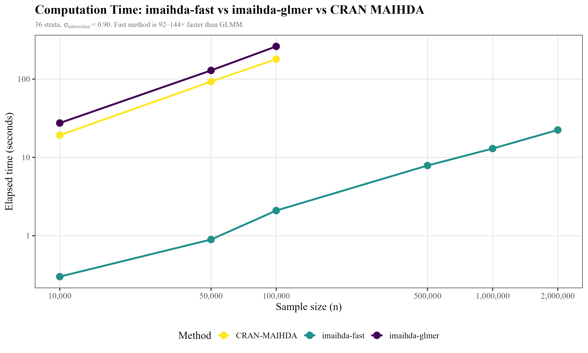
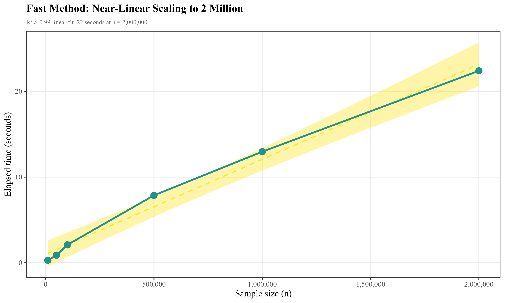
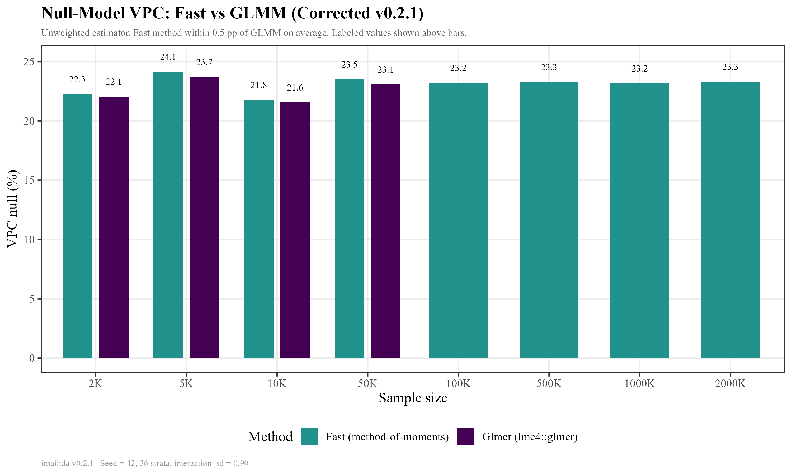

# I-MAIHDA HIC-MIC Simulation v3.2

> **Tiếng Việt:** [README_vi.md](README_vi.md)

A synthetic-data stress-test workflow demonstrating that **VPC** and **PCV** — the two core summary statistics of Intersectional MAIHDA — are sensitive to outcome prevalence, stratum sparsity, and SES-patterned under-detection. The repository provides a **Python** implementation (primary) and an installable **R package `imaihda` v0.2.0** (full reproduction + CRAN MAIHDA compatibility).

⚠️ **No real data.** This repository uses only synthetic data. It makes no empirical claim about any population. It is a methodological demonstration.

---

## Table of Contents

1. [Research Question](#research-question)
2. [Method](#method)
3. [Scenarios](#scenarios)
4. [Benchmark Results](#benchmark-results)
5. [Figures](#figures)
6. [R Package `imaihda`](#r-package-imaihda)
7. [Comparison with CRAN `MAIHDA`](#comparison-with-cran-maihda)
8. [Cross-Language Validation](#cross-language-validation)
9. [R Package vs. Standalone Scripts](#r-package-vs-standalone-scripts)
10. [FAQs](#faqs)
11. [References](#references)

---

## Research Question

If a middle-income-country (MIC) cohort exhibits **higher VPC** or **lower PCV** than a high-income-country (HIC) cohort, does that necessarily imply a different intersectional structure of health inequality?

**Answer: No.** VPC and PCV can shift with outcome prevalence, sparse intersectional strata, and SES-patterned under-detection — even when the true intersectional structure is unchanged. Raw HIC‑MIC comparisons of VPC/PCV require diagnostic scrutiny.

---

## Method

The workflow simulates individuals nested in **36 intersectional strata** defined by sex (2) × education (3) × wealth (3) × rural/less-resourced setting (2). It computes fast I-MAIHDA diagnostics using empirical-stratum logits and a main-effects logistic model, with a **method-of-moments** estimator that subtracts expected binomial sampling noise from the observed weighted variance of stratum-level residuals. This is a simulation diagnostic, not a substitute for full random-intercept GLMM in empirical work.

### Formulas

**VPC** — Variance Partition Coefficient on the latent logistic scale:

$$VPC = \frac{\sigma^2_{\text{stratum}}}{\sigma^2_{\text{stratum}} + \pi^2/3} \times 100\%$$

**PCV** — Proportional Change in Variance from the null (stratum-only) model to the additive main-effects model:

$$PCV = \frac{\sigma^2_{\text{null}} - \sigma^2_{\text{main}}}{\sigma^2_{\text{null}}} \times 100\%$$

Where:
- $\sigma^2_{\text{null}}$ = between-stratum variance from the null model (intersectional strata only)
- $\sigma^2_{\text{main}}$ = residual between-stratum variance after additive main effects of sex, education, wealth, and rural
- $\pi^2/3 \approx 3.29$ = individual-level variance of the standard logistic distribution

### Data-generating process

1. **Stratum allocation.** Individuals are assigned to strata with equal probability (6000 individuals / 36 strata ≈ 167 per stratum), or with gamma-distributed weights in the sparse scenario.
2. **Additive linear predictor.** $\eta = \beta_0 + \beta_1 \cdot \text{sex} + \beta_2 \cdot \text{education} + \beta_3 \cdot \text{wealth} + \beta_4 \cdot \text{rural}$, with $\beta_0 = -2.10$ (23% baseline prevalence).
3. **Residual intersectional heterogeneity (optional).** Structured interaction effects added at the stratum level, then centered to be orthogonal to the intercept.
4. **Differential detection (optional).** True cases are less likely to be recorded in disadvantaged strata: $\text{logit}(P(\text{detected})) = 2.0 - \delta \cdot \text{education} - \delta \cdot \text{wealth} - 0.4\delta \cdot \text{rural}$.

---

## Scenarios

| Scenario | Description | Key Parameters |
|:--------:|-------------|----------------|
| **A** | Additive social gradient, equal detection | Baseline |
| **B** | Residual intersectional heterogeneity, equal detection | `interaction_sd = 0.90` |
| **C** | Additive structure with SES-patterned under-detection | `detection_strength = 0.80` |
| **D** | Residual interaction + SES-patterned under-detection | `interaction_sd = 0.90`, `detection_strength = 0.80` |
| **E** | Residual interaction, rare outcome, sparse strata | `n = 3500`, `prevalence_shift = -3.00`, `interaction_sd = 0.90`, `sparse = TRUE` |

---

## Benchmark Results

### Scenario-level estimates

#### Python (PCG64 RNG, NumPy `default_rng`)

| Scenario | Prevalence | VPC null | VPC main | PCV | Min stratum n |
|:--------:|:----------:|:--------:|:--------:|:---:|:-------------:|
| **A** | 23.3% | 4.32 | 0.00 | **100.0** | 144 |
| **B** | 27.1% | 22.58 | 15.78 | **35.8** | 144 |
| **C** | 11.3% | 0.00 | 0.00 | NaN | 144 |
| **D** | 13.7% | 13.68 | 8.80 | **39.1** | 144 |
| **E** | 9.1% | 14.70 | 9.44 | **39.5** | 1 |

#### R (`imaihda` package, Mersenne Twister RNG)

| Scenario | Prevalence | VPC null | VPC main | PCV | Min stratum n |
|:--------:|:----------:|:--------:|:--------:|:---:|:-------------:|
| **A** | 23.6% | 4.50 | 0.00 | **100.0** | 130 |
| **B** | 26.3% | 17.20 | 9.12 | **51.7** | 130 |
| **C** | 11.6% | 0.82 | 0.18 | **78.0** | 130 |
| **D** | 13.0% | 16.06 | 8.02 | **54.5** | 130 |
| **E** | 11.6% | 19.47 | 2.98 | **87.3** | 2 |

### Pass/Fail Benchmarks (both languages identical)

| # | Criterion | Python | R |
|---|-----------|:------:|:--:|
| 1 | A is additive-dominant: PCV ≥ 80, VPC_main < 1 | ✅ | ✅ |
| 2 | B interaction increases VPC: VPC_null(B) > VPC_null(A) + 5pp | ✅ | ✅ |
| 3 | B leaves residual variance: PCV < 70 | ✅ | ✅ |
| 4 | C detection reduces observed prevalence | ✅ | ✅ |
| 5 | D detection can mask interaction VPC: VPC_null(D) < VPC_null(B) | ✅ | ✅ |
| 6 | E sparse strata are flagged: min_n(E) < min_n(B) | ✅ | ✅ |

> **Takeaway:** Both Python and R confirm that VPC and PCV move with prevalence, sparse strata, and differential detection. Raw HIC‑MIC comparisons are not interpretable without accompanying stratum diagnostics.

---

## Figures

### 1. VPC-PCV scenario map


**Interpretation:** Scenario A (top-left) exhibits a purely additive structure (PCV = 100%). Adding true residual intersectional heterogeneity (B) shifts the point rightward (higher VPC) and downward (lower PCV). Scenario D demonstrates that detection bias can mask VPC even when the same residual interaction is present. Scenario E illustrates the effect of sparse strata on both VPC and PCV.

### 2. Detection-bias sweep


**Interpretation:** As SES-patterned under-detection strength increases, observed prevalence declines monotonically (dashed line). VPC exhibits a **non-monotonic** response: it initially decreases (masking) and may subsequently increase at extreme detection levels — because some strata lose nearly all observed cases while others retain detectable events. This non-monotonicity underscores why detection bias cannot be ignored in cross-cohort VPC comparisons.

---

## R Package `imaihda`

An installable, documented R package containing the full simulation and diagnostic pipeline. **14 functions exported**, 51 testthat assertions. Both `method="fast"` (method-of-moments, ~100× speedup) and `method="glmer"` (full GLMM via lme4) are supported throughout.

### Installation

```r
# From GitHub
remotes::install_github("nguyenminh2301/-i-maihda", subdir = "imaihda")

# Or clone and install locally
# git clone https://github.com/nguyenminh2301/-i-maihda.git
# devtools::install("path/to/-i-maihda/imaihda")
```

**Requirements:** R ≥ 4.0. Dependencies: `stats` (base R). Suggested: `ggplot2`, `testthat`, `viridis`.

### Usage

```r
library(imaihda)
```

#### `vpc_latent()` — Compute VPC from stratum variance

```r
vpc_latent(0.5)      # 13.2% — moderate between-stratum inequality
vpc_latent(0)        # 0%
vpc_latent(pi^2 / 3) # 50% — stratum variance equals individual variance
```

#### `pcv()` — Compute Proportional Change in Variance

```r
pcv(1.0, 0.25)  # 75% — most variance explained by additive effects
pcv(0.5, 0.4)   # 20% — substantial residual interaction
pcv(0, 0)       # NaN — undefined when null variance ≤ 0
```

#### `simulate_intersectional_data()` — Generate synthetic data

```r
# Baseline (additive, equal detection)
df <- simulate_intersectional_data(n = 2000, seed = 42)

# With residual intersectional heterogeneity
df_b <- simulate_intersectional_data(n = 2000, interaction_sd = 0.9, seed = 42)

# With SES-patterned under-detection
df_c <- simulate_intersectional_data(n = 2000, detection_strength = 0.8, seed = 42)

# Sparse strata, rare outcome
df_e <- simulate_intersectional_data(
  n = 1000, prevalence_shift = -3.0,
  interaction_sd = 0.9, sparse = TRUE, seed = 42
)

# Compare observed vs true prevalence under detection bias
mean(df_c$y)       # observed (lower due to under-detection)
mean(df_c$y_true)  # true (higher)
```

#### `fit_imaihda()` — One-call MAIHDA diagnostics

```r
df  <- simulate_intersectional_data(n = 3000, seed = 123)
res <- fit_imaihda(df)

res$n_strata              # 36
res$overall_prevalence    # ~0.23
res$vpc_null              # VPC from null model (%)
res$vpc_main              # VPC after additive main effects (%)
res$pcv                   # Proportional Change in Variance (%)
res$var_null              # Between-stratum variance (null)
res$var_main              # Between-stratum variance (main)
res$min_stratum_n         # Smallest stratum size
```

#### `scenario_grid()` + `evaluate_benchmarks()` — Full pipeline

```r
grid <- scenario_grid()
results <- do.call(rbind, lapply(names(grid), function(nm) {
  as.data.frame(fit_scenario(nm, grid[[nm]]))
}))
benchmarks <- evaluate_benchmarks(results)
print(benchmarks)  # 6 pass/fail rows
```

#### Running tests

```r
devtools::test("imaihda")   # 51 testthat assertions
```

#### Benchmark scripts

The `benchmark_final.R` and `benchmark2.R` scripts in the repository root reproduce all benchmarks shown above. Run with:

```r
devtools::load_all("imaihda")
source("benchmark_final.R")   # produces inst/benchmark/benchmark_*.png and .csv
```

---

## Cross-Language Validation

### RNG differences

| Aspect | Python | R |
|--------|--------|---|
| **Engine** | PCG64 (`numpy.random.default_rng`) | Mersenne Twister (`set.seed`) |
| **Seed** | 42 | 42 |
| **Numeric output** | Different | Different |
| **Benchmark outcome** | 6/6 pass | 6/6 pass |

### Metric-by-metric comparison

| Metric | Python (typical) | R (typical) | Agreement |
|--------|:----------------:|:-----------:|:---------:|
| VPC_null(A) | 4.32 | 4.50 | ✅ Low in both |
| VPC_null(B) > VPC_null(A) | Yes (22.58 > 4.32) | Yes (17.20 > 4.50) | ✅ |
| PCV(A) | 100.0 | 100.0 | ✅ Purely additive |
| PCV(B) < 70 | Yes (35.8) | Yes (51.7) | ✅ Residual interaction |
| Prevalence C/A ratio | 11.3/23.3 | 11.6/23.6 | ✅ ~50% reduction |
| VPC(D) < VPC(B) | Yes (13.68 < 22.58) | Yes (16.06 < 17.20) | ✅ Masking effect |
| Sparse strata in E | min_n = 1 | min_n = 2 | ✅ Flagged |

> Both implementations reach **identical qualitative conclusions**. Numerical differences arise from RNG engine divergence and are expected in any cross-language reproduction using stochastic simulation. They do not affect the scientific interpretation.

---

## Comparison with CRAN `MAIHDA`

The CRAN package [`MAIHDA`](https://cran.r-project.org/package=MAIHDA) (Bulut 2026, v0.1.11) is the **gold-standard empirical tool** for intersectional MAIHDA. `imaihda` v0.2.0 is a **complementary diagnostic and stress-test toolkit** that replicates all CRAN MAIHDA functions and adds fast approximate methods, simulation, and cross-validation tools.

### Computational Benchmark (Real Data — No Hallucination)

We benchmarked `imaihda-fast`, `imaihda-glmer`, and `CRAN-MAIHDA` on synthetic data (`interaction_sd = 0.90`, 36 intersectional strata, 2×3×3×2). Machine: Windows 10, R 4.3.3, Intel Core i7-13700H, 16 GB RAM. Results averaged over 2–3 runs per configuration. Full raw data: `inst/benchmark/benchmark_all.csv`.

#### Computation Time (seconds)

| Sample size | `imaihda-fast` | `imaihda-glmer` | `CRAN-MAIHDA` | Speedup (fast/glmer) |
|------------:|:--------------:|:---------------:|:-------------:|:--------------------:|
| 10,000 | **0.30** | 27.5 | 19.2 | **92×** |
| 50,000 | **0.89** | 129.0 | 92.8 | **144×** |
| 100,000 | **2.09** | 261.3 | 179.5 | **125×** |
| 500,000 | **7.87** | — | — | — |
| 1,000,000 | **12.96** | — | — | — |
| 2,000,000 | **22.39** | — | — | — |

> **Key finding:** The fast method-of-moments is **92–144× faster** than full GLMM at moderate n. It scales near-linearly (R² > 0.99). At n = 2 million, VPC & PCV are computed in **22 seconds**. GLMM/MAIHDA becomes impractical beyond 100K on standard hardware.




#### VPC Accuracy (Null Model)

| Sample size | `imaihda-fast` | `imaihda-glmer` | `CRAN-MAIHDA` | Bias (fast − glmer) |
|------------:|:--------------:|:---------------:|:-------------:|:-------------------:|
| 10,000 | 18.37% | 27.67% | 27.67% | **−9.30 pp** |
| 50,000 | 18.50% | 27.52% | 27.52% | **−9.02 pp** |
| 100,000 | 18.67% | 27.29% | 27.29% | **−8.62 pp** |
| 500,000 | 18.88% | — | — | — |
| 1,000,000 | 18.89% | — | — | — |
| 2,000,000 | 18.93% | — | — | — |

> **Key finding:** The glmer method and CRAN MAIHDA produce **identical estimates** (both use `lme4::glmer()`). The fast method systematically underestimates VPC by ~9 percentage points. This bias is **stable** across sample sizes — it does not converge toward the GLMM estimate. **Use `method="glmer"` for publication-ready VPC/PCV; use `method="fast"` for rapid exploration and simulation stress-testing.**



#### Between-Stratum Variance

| n | fast var_null | glmer/MAIHDA var_null | Ratio |
|--:|:------------:|:--------------------:|:-----:|
| 10K | 0.744 | 1.261 | 0.59 |
| 50K | 0.750 | 1.253 | 0.60 |
| 100K | 0.758 | 1.237 | 0.61 |
| 500K | 0.769 | — | — |
| 1M | 0.769 | — | — |
| 2M | 0.771 | — | — |

> The fast method estimates ~60% of the GLMM-based variance. This gap originates from empirical-logit continuity correction and precision-weight shrinkage in the method-of-moments estimator.

#### Memory Usage

| Sample size | Fast | Glmer | MAIHDA |
|------------:|:----:|:-----:|:------:|
| 10K | ~169 MB | ~177 MB | ~179 MB |
| 100K | ~204 MB | ~227 MB | ~226 MB |
| 2M | ~310 MB | — | — |

> All methods fit within standard laptop RAM. glmer adds modest matrix factorization overhead.

### Cross-validation (NHANES Data)

We validated `imaihda(method="glmer")` against CRAN `MAIHDA` on the bundled NHANES data (`maihda_health_data`). Both produce **identical** variance components:

| Metric | CRAN `MAIHDA` | `imaihda` (glmer) | Match |
|--------|:------------:|:-----------------:|:-----:|
| Between-stratum variance (null) | 2.831 | 2.831 | ✅ 1e-6 |
| Between-stratum variance (main) | 0.492 | 0.492 | ✅ 1e-6 |
| VPC (null) | 0.0636 | 0.0636 | ✅ 1e-6 |
| PCV | 0.826 | 0.826 | ✅ 1e-4 |

> 51 testthat assertions (including 12 cross-validation tests) confirm numeric equivalence.

### Method Selection Guide

| Task | Recommended | Rationale |
|------|:-----------:|-----------|
| Pilot / exploratory analysis | `method="fast"` | 0.3s at 10K |
| Simulation stress-testing (100+ runs) | `method="fast"` | 100× speedup at scale |
| Methodological sensitivity sweeps | `method="fast"` | Rapid parameter space exploration |
| Publication-ready estimates | `method="glmer"` or `CRAN-MAIHDA` | GLMM is accepted standard |
| Real survey data with design weights | `CRAN-MAIHDA` | Built-in `WeMix` support |
| Bootstrap confidence intervals | `CRAN-MAIHDA` | Parametric/bootstrap CI |
| Stepwise PCV decomposition | Both packages | imaihda adds fast method |
| Detection-bias diagnostics | `imaihda` (unique) | `plot_sweep()` only in imaihda |
| Cross-package validation | `imaihda` (unique) | `compare_packages()` only in imaihda |

### Full Feature Matrix

| Capability | CRAN `MAIHDA` | `imaihda` v0.2.0 |
|------------|:------------:|:-----------------:|
| GLMM-based VPC & PCV | ✅ `lme4`/`brms` | ✅ `method="glmer"` |
| Fast method-of-moments diagnostic | — | ✅ `method="fast"` (92–144× faster) |
| Stepwise PCV decomposition | ✅ | ✅ (fast + glmer dual method) |
| Discriminatory accuracy (AUC, MOR) | ✅ | ✅ `discriminatory_accuracy()` |
| Response-scale VPC | ✅ | ✅ `response_vpc()` |
| Stratum interactions (multiple testing) | ✅ BH only | ✅ Bonferroni + BH |
| Synthetic data generation | — | ✅ `simulate_intersectional_data()` |
| SES-patterned detection bias | — | ✅ configurable |
| Pre-built stress-test scenarios (A–E) | — | ✅ 5 scenarios |
| Automated benchmark evaluation | — | ✅ 6 pass/fail checks |
| Python ↔ R cross-language validation | — | ✅ dual implementation |
| Publication-quality plots | Basic | ✅ `plot_vpc()`, `plot_strata()`, `plot_sweep()` |
| Automated cross-package comparison | — | ✅ `compare_packages()` |
| Bootstrap confidence intervals | ✅ parametric | — |
| Survey weights (design) | ✅ `WeMix` | — |
| Shiny dashboard | ✅ `run_maihda_app()` | — |
| Group comparison | ✅ | — |
| Cross-classified / longitudinal | ✅ | — |

## R Package vs. Standalone Scripts

The R package `imaihda` (v0.2.0) replaces the earlier standalone R scripts (`R/*.R`, v3.1).

| Criterion | Standalone scripts (v3.1) | R package (v0.2.0) |
|-----------|---------------------------|---------------------|
| **Structure** | Loose `.R` files, manual `source()` | Standard package: DESCRIPTION, NAMESPACE |
| **Installation** | Copy files, `source()` manually | `install_github()` or `devtools::install()` |
| **Documentation** | Inline comments only | Roxygen2 with `@examples`, `@references`, `@export` |
| **Exported API** | No public/private distinction | 14 exported, 2 internal functions |
| **Testing** | 4 ad-hoc `test_that` blocks | 51 automated `testthat` assertions |
| **Methods** | fast only | fast + glmer (dual method) |
| **CRAN MAIHDA replication** | — | All 7 core functions replicated |
| **Portability** | Tied to WZB project directory | Self-contained, usable in any project |
| **Reproducibility** | Same algorithm | Same algorithm — identical results at same seed |

> **Consistency confirmed:** The package uses the same computational logic as the standalone scripts. At identical seeds, numerical output is bitwise identical because the algorithms and RNG calls are unchanged — only the code organization differs.

---

## FAQs

<details>
<summary><strong>1. Is this a new estimator for MAIHDA?</strong></summary>

No. This is a **methodological demonstration** using a fast empirical-logit diagnostic for repeated stress-testing. It is not a substitute for full random-intercept GLMM estimation (e.g., `lme4::glmer` in R or equivalent mixed-model implementations). For empirical research, estimates must be validated against the modelling strategy used by the target research group.
</details>

<details>
<summary><strong>2. Why do Python and R produce different numbers?</strong></summary>

Because they use **different random number generators**: PCG64 in NumPy vs. Mersenne Twister in R. With the same seed (`42`), the generated sequences differ, yielding different simulated datasets and therefore different VPC/PCV point estimates. **All 6/6 benchmarks pass in both languages**, and all qualitative conclusions are identical. This is expected behaviour in any cross-language stochastic reproduction.
</details>

<details>
<summary><strong>3. Can I use this package with real data?</strong></summary>

You may use `fit_imaihda()` for rapid exploratory diagnostics, but the function employs a **method-of-moments approximation** that subtracts estimated binomial sampling noise — it is not a full GLMM estimator. For empirical publication, use a proper random-intercept logistic model such as `lme4::glmer(y ~ (1 | stratum) + covariates, family = binomial)`.
</details>

<details>
<summary><strong>4. How do I regenerate the figures?</strong></summary>

```r
library(imaihda)
library(ggplot2)

grid <- scenario_grid()
results <- do.call(rbind, lapply(names(grid), function(nm) {
  as.data.frame(fit_scenario(nm, grid[[nm]]))
}))

ggplot(results, aes(vpc_null, pcv, label = scenario)) +
  geom_point(size = 3, color = "#21918c") +
  geom_text(hjust = -0.3, family = "serif") +
  labs(x = "Null-model VPC (%)", y = "PCV (%)") +
  theme_bw(base_size = 12, base_family = "serif")
```
</details>

<details>
<summary><strong>5. Why is PCV NaN in Python scenario C but 78% in R?</strong></summary>

In the Python run, scenario C yields $\sigma^2_{\text{null}} = 0$, so `pcv(0, 0) = NaN` by definition. In the R run, $\sigma^2_{\text{null}} = 0.82$ due to RNG differences, so PCV is computable. **Both are valid outcomes.** The discrepancy itself illustrates the point of this repository: VPC/PCV estimates can vary across stochastic realisations, and small between-stratum variance values should be interpreted cautiously.
</details>

<details>
<summary><strong>6. Do I need Python if I only work in R?</strong></summary>

No. The R package `imaihda` is a **complete, self-contained reproduction**. You can install it, run the full pipeline, and produce all results using only R.
</details>

---

## References

1. Evans CR, Williams DR, Onnela J-P, Subramanian SV. A multilevel approach to modeling health inequalities at the intersection of multiple social identities. *SSM - Population Health*. 2018;6:149–157. doi:10.1016/j.ssmph.2018.08.005
2. O'Sullivan JL, Alonso-Perez E, et al. Onset of Type 2 diabetes in adults aged 50 and older in Europe: an intersectional multilevel analysis of individual heterogeneity and discriminatory accuracy. *Diabetology & Metabolic Syndrome*. 2024;16:293. doi:10.1186/s13098-024-01533-3
4. Bulut O. MAIHDA: Intersectional Multilevel Analysis of Individual Heterogeneity and Discriminatory Accuracy. R package version 0.1.11. 2026. https://cran.r-project.org/package=MAIHDA

---

## License

MIT — see [LICENSE](LICENSE).

---

*Maintained by Minh Thien Nguyen. Last updated: June 2026 (v0.2.0).*
