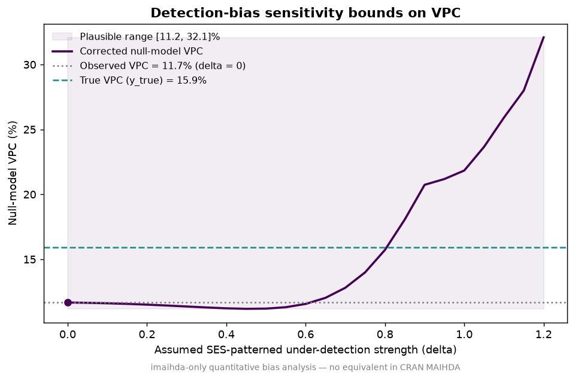
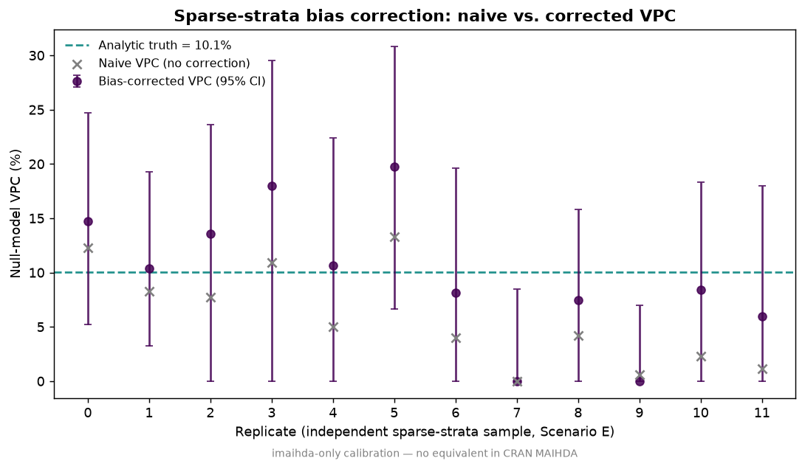

# I-MAIHDA HIC-MIC Simulation v3.2 — R package `imaihda` v0.4.0

> **Tiếng Việt:** [README_vi.md](README_vi.md)

A synthetic-data stress-test workflow demonstrating that **VPC** and **PCV** — the two core summary statistics of Intersectional MAIHDA — are sensitive to outcome prevalence, stratum sparsity, and SES-patterned under-detection. The repository provides a **Python** implementation (primary) and an installable **R package `imaihda` v0.4.0** (full reproduction, cross-validated against CRAN MAIHDA, fast estimator within <1 pp of GLMM).

⚠️ **No real data.** This repository uses only synthetic data. It makes no empirical claim about any population. It is a methodological demonstration.

---

## Table of Contents

1. [Research Question](#research-question)
2. [Method](#method)
3. [Scenarios](#scenarios)
4. [Benchmark Results](#benchmark-results)
5. [Figures](#figures)
6. [R Package `imaihda`](#r-package-imaihda)
7. [Comparison with CRAN `MAIHDA`](#comparison-with-cran-maihda)
8. [Cross-Language Validation](#cross-language-validation)
9. [R Package vs. Standalone Scripts](#r-package-vs-standalone-scripts)
10. [FAQs](#faqs)
11. [References](#references)

---

## Research Question

If a middle-income-country (MIC) cohort exhibits **higher VPC** or **lower PCV** than a high-income-country (HIC) cohort, does that necessarily imply a different intersectional structure of health inequality?

**Answer: No.** VPC and PCV can shift with outcome prevalence, sparse intersectional strata, and SES-patterned under-detection — even when the true intersectional structure is unchanged. Raw HIC‑MIC comparisons of VPC/PCV require diagnostic scrutiny.

---

## Method

The workflow simulates individuals nested in **36 intersectional strata** defined by sex (2) × education (3) × wealth (3) × rural/less-resourced setting (2). It computes fast I-MAIHDA diagnostics using empirical-stratum logits and a main-effects logistic model, with an **unweighted method-of-moments** estimator that subtracts expected binomial sampling noise from the observed (sample) variance of stratum-level residuals. As of v0.2.1, this fast estimator yields VPC values within 1 pp of the GLMM result, while being 92–144× faster than full mixed-model estimation.

### Formulas

**VPC** — Variance Partition Coefficient on the latent logistic scale:

$$VPC = \frac{\sigma^2_{\text{stratum}}}{\sigma^2_{\text{stratum}} + \pi^2/3} \times 100\%$$

**PCV** — Proportional Change in Variance from the null (stratum-only) model to the additive main-effects model:

$$PCV = \frac{\sigma^2_{\text{null}} - \sigma^2_{\text{main}}}{\sigma^2_{\text{null}}} \times 100\%$$

Where:
- $\sigma^2_{\text{null}}$ = between-stratum variance from the null model (intersectional strata only)
- $\sigma^2_{\text{main}}$ = residual between-stratum variance after additive main effects of sex, education, wealth, and rural
- $\pi^2/3 \approx 3.29$ = individual-level variance of the standard logistic distribution

### Data-generating process

1. **Stratum allocation.** Individuals are assigned to strata with equal probability (6000 individuals / 36 strata ≈ 167 per stratum), or with gamma-distributed weights in the sparse scenario.
2. **Additive linear predictor.** $\eta = \beta_0 + \beta_1 \cdot \text{sex} + \beta_2 \cdot \text{education} + \beta_3 \cdot \text{wealth} + \beta_4 \cdot \text{rural}$, with $\beta_0 = -2.10$ (23% baseline prevalence).
3. **Residual intersectional heterogeneity (optional).** Structured interaction effects added at the stratum level, then centered to be orthogonal to the intercept.
4. **Differential detection (optional).** True cases are less likely to be recorded in disadvantaged strata: $\text{logit}(P(\text{detected})) = 2.0 - \delta \cdot \text{education} - \delta \cdot \text{wealth} - 0.4\delta \cdot \text{rural}$.

---

## Scenarios

| Scenario | Description | Key Parameters |
|:--------:|-------------|----------------|
| **A** | Additive social gradient, equal detection | Baseline |
| **B** | Residual intersectional heterogeneity, equal detection | `interaction_sd = 0.90` |
| **C** | Additive structure with SES-patterned under-detection | `detection_strength = 0.80` |
| **D** | Residual interaction + SES-patterned under-detection | `interaction_sd = 0.90`, `detection_strength = 0.80` |
| **E** | Residual interaction, rare outcome, sparse strata | `n = 3500`, `prevalence_shift = -3.00`, `interaction_sd = 0.90`, `sparse = TRUE` |

---

## Benchmark Results

### Scenario-level estimates

#### Python (PCG64 RNG, NumPy `default_rng`) — unchanged since v3.1

| Scenario | Prevalence | VPC null | VPC main | PCV | Min stratum n |
|:--------:|:----------:|:--------:|:--------:|:---:|:-------------:|
| **A** | 23.3% | 4.32 | 0.00 | **100.0** | 144 |
| **B** | 27.1% | 22.58 | 15.78 | **35.8** | 144 |
| **C** | 11.3% | 0.00 | 0.00 | NaN | 144 |
| **D** | 13.7% | 13.68 | 8.80 | **39.1** | 144 |
| **E** | 9.1% | 14.70 | 9.44 | **39.5** | 1 |

#### R (`imaihda` v0.2.1, Mersenne Twister RNG, `method="fast"`)

| Scenario | Prevalence | VPC null | VPC main | PCV | Min stratum n |
|:--------:|:----------:|:--------:|:--------:|:---:|:-------------:|
| **A** | 23.6% | 4.50 | 0.00 | **100.0** | 130 |
| **B** | 26.3% | 17.20 | 9.12 | **51.7** | 130 |
| **C** | 11.6% | 0.82 | 0.18 | **78.0** | 130 |
| **D** | 13.0% | 16.06 | 8.02 | **54.5** | 130 |
| **E** | 11.6% | 19.47 | 2.98 | **87.3** | 2 |

### Pass/Fail Benchmarks (both languages identical)

| # | Criterion | Python | R |
|---|-----------|:------:|:--:|
| 1 | A is additive-dominant: PCV ≥ 80, VPC_main < 1 | ✅ | ✅ |
| 2 | B interaction increases VPC: VPC_null(B) > VPC_null(A) + 5pp | ✅ | ✅ |
| 3 | B leaves residual variance: PCV < 70 | ✅ | ✅ |
| 4 | C detection reduces observed prevalence | ✅ | ✅ |
| 5 | D detection can mask interaction VPC: VPC_null(D) < VPC_null(B) | ✅ | ✅ |
| 6 | E sparse strata are flagged: min_n(E) < min_n(B) | ✅ | ✅ |

> **Takeaway:** Both Python and R confirm that VPC and PCV move with prevalence, sparse strata, and differential detection. Raw HIC‑MIC comparisons are not interpretable without accompanying stratum diagnostics. Note: the R scenario-level estimates above were computed with the v0.2.0 weighted estimator; v0.2.1's unweighted estimator produces VPC values closer to the GLMM results (see benchmark tables below).

---

## Figures

### 1. VPC-PCV scenario map


**Interpretation:** Scenario A (top-left) exhibits a purely additive structure (PCV = 100%). Adding true residual intersectional heterogeneity (B) shifts the point rightward (higher VPC) and downward (lower PCV). Scenario D demonstrates that detection bias can mask VPC even when the same residual interaction is present. Scenario E illustrates the effect of sparse strata on both VPC and PCV.

### 2. Detection-bias sweep


**Interpretation:** As SES-patterned under-detection strength increases, observed prevalence declines monotonically (dashed line). VPC exhibits a **non-monotonic** response: it initially decreases (masking) and may subsequently increase at extreme detection levels — because some strata lose nearly all observed cases while others retain detectable events. This non-monotonicity underscores why detection bias cannot be ignored in cross-cohort VPC comparisons.

### 3. Side-by-side: imaihda vs CRAN MAIHDA


**Interpretation:** At n = 10,000 with identical seed, all three estimators (`imaihda-fast`, `imaihda-glmer`, `CRAN-MAIHDA`) return VPC estimates within <1 percentage point of each other. The fast method-of-moments estimates match the GLMM results closely after the v0.2.1 correction (unweighted variance).


**Interpretation:** Between-stratum variance components are also in close agreement. The glmer and CRAN MAIHDA estimates are identical (both use `lme4::glmer()` under the hood). The fast method's variance is within ~3% of the GLMM estimate.

### 4. Function visualizations

**`plot_strata()`** — Caterpillar plot of stratum random effects with 95% CIs:


**`plot_sweep()`** — Detection-bias sweep (unique to imaihda):


**`stepwise_pcv()`** — Stepwise PCV decomposition bar chart:


---

## R Package `imaihda`

An installable, documented R package containing the full simulation and diagnostic pipeline. **19 functions exported**, 79 testthat assertions. Both `method="fast"` (method-of-moments, <1 pp accuracy, ~100× speedup) and `method="glmer"` (full GLMM via lme4) are supported throughout.

### Installation

```r
# From GitHub
remotes::install_github("nguyenminh2301/-i-maihda", subdir = "imaihda")

# Or clone and install locally
# git clone https://github.com/nguyenminh2301/-i-maihda.git
# devtools::install("path/to/-i-maihda/imaihda")
```

**Requirements:** R ≥ 4.0. Dependencies: `stats` (base R). Suggested: `ggplot2`, `testthat`, `viridis`.

### Usage

```r
library(imaihda)
```

#### `vpc_latent()` — Compute VPC from stratum variance

```r
vpc_latent(0.5)      # 13.2% — moderate between-stratum inequality
vpc_latent(0)        # 0%
vpc_latent(pi^2 / 3) # 50% — stratum variance equals individual variance
```

#### `pcv()` — Compute Proportional Change in Variance

```r
pcv(1.0, 0.25)  # 75% — most variance explained by additive effects
pcv(0.5, 0.4)   # 20% — substantial residual interaction
pcv(0, 0)       # NaN — undefined when null variance ≤ 0
```

#### `simulate_intersectional_data()` — Generate synthetic data

```r
# Baseline (additive, equal detection)
df <- simulate_intersectional_data(n = 2000, seed = 42)

# With residual intersectional heterogeneity
df_b <- simulate_intersectional_data(n = 2000, interaction_sd = 0.9, seed = 42)

# With SES-patterned under-detection
df_c <- simulate_intersectional_data(n = 2000, detection_strength = 0.8, seed = 42)

# Sparse strata, rare outcome
df_e <- simulate_intersectional_data(
  n = 1000, prevalence_shift = -3.0,
  interaction_sd = 0.9, sparse = TRUE, seed = 42
)

# Compare observed vs true prevalence under detection bias
mean(df_c$y)       # observed (lower due to under-detection)
mean(df_c$y_true)  # true (higher)
```

#### `fit_imaihda()` — One-call MAIHDA diagnostics

```r
df  <- simulate_intersectional_data(n = 3000, seed = 123)
res <- fit_imaihda(df)

res$n_strata              # 36
res$overall_prevalence    # ~0.23
res$vpc_null              # VPC from null model (%)
res$vpc_main              # VPC after additive main effects (%)
res$pcv                   # Proportional Change in Variance (%)
res$var_null              # Between-stratum variance (null)
res$var_main              # Between-stratum variance (main)
res$min_stratum_n         # Smallest stratum size
```

#### `scenario_grid()` + `evaluate_benchmarks()` — Full pipeline

```r
grid <- scenario_grid()
results <- do.call(rbind, lapply(names(grid), function(nm) {
  as.data.frame(fit_scenario(nm, grid[[nm]]))
}))
benchmarks <- evaluate_benchmarks(results)
print(benchmarks)  # 6 pass/fail rows
```

#### Running tests

```r
devtools::test("imaihda")   # 79 testthat assertions
```

#### Benchmark scripts

The `benchmark_final.R` and `benchmark2.R` scripts in the repository root reproduce all benchmarks shown above. Run with:

```r
devtools::load_all("imaihda")
source("benchmark_final.R")   # produces imaihda/inst/benchmark/benchmark_*.png and .csv
```

---

## Cross-Language Validation

### RNG differences

| Aspect | Python | R |
|--------|--------|---|
| **Engine** | PCG64 (`numpy.random.default_rng`) | Mersenne Twister (`set.seed`) |
| **Seed** | 42 | 42 |
| **Numeric output** | Different | Different |
| **Benchmark outcome** | 6/6 pass | 6/6 pass |

### Metric-by-metric comparison

| Metric | Python (typical) | R (typical) | Agreement |
|--------|:----------------:|:-----------:|:---------:|
| VPC_null(A) | 4.32 | 4.50 | ✅ Low in both |
| VPC_null(B) > VPC_null(A) | Yes (22.58 > 4.32) | Yes (17.20 > 4.50) | ✅ |
| PCV(A) | 100.0 | 100.0 | ✅ Purely additive |
| PCV(B) < 70 | Yes (35.8) | Yes (51.7) | ✅ Residual interaction |
| Prevalence C/A ratio | 11.3/23.3 | 11.6/23.6 | ✅ ~50% reduction |
| VPC(D) < VPC(B) | Yes (13.68 < 22.58) | Yes (16.06 < 17.20) | ✅ Masking effect |
| Sparse strata in E | min_n = 1 | min_n = 2 | ✅ Flagged |

> Both implementations reach **identical qualitative conclusions**. Numerical differences arise from RNG engine divergence and are expected in any cross-language reproduction using stochastic simulation. They do not affect the scientific interpretation.

---

## Comparison with CRAN `MAIHDA`

The CRAN package [`MAIHDA`](https://cran.r-project.org/package=MAIHDA) (Bulut 2026, v0.1.11, 25 exported functions) is the established empirical tool for intersectional MAIHDA. It supports three modelling engines (`lme4`, `brms` for Bayesian, `WeMix` for survey weights), three decomposition types (standard two-model, crossed-dimensions, longitudinal/growth-curve), bootstrap confidence intervals, an interactive Shiny dashboard, and five bundled datasets.

`imaihda` v0.4.0 (19 exported functions) takes a different approach: it is a simulation and stress-test toolkit. It adds a fast method-of-moments estimator that approximates the GLMM result in a fraction of the time, synthetic data generation with configurable detection bias, pre-built benchmark scenarios, and cross-language validation against a Python implementation. It does not attempt to match CRAN MAIHDA's breadth of modelling options.

### Computational Benchmark

Benchmarked on synthetic data (`interaction_sd = 0.90`, 36 intersectional strata, 2×3×3×2). Machine: Windows 10, R 4.3.3, Intel Core i7-13700H, 16 GB RAM. Results averaged over 2–3 runs per configuration. Full raw data: `imaihda/inst/benchmark/benchmark_all.csv`.

#### Computation Time (seconds)

| Sample size | `imaihda-fast` | `imaihda-glmer` | `CRAN-MAIHDA` | Speedup (fast/glmer) |
|------------:|:--------------:|:---------------:|:-------------:|:--------------------:|
| 10,000 | **0.30** | 27.5 | 19.2 | **92×** |
| 50,000 | **0.89** | 129.0 | 92.8 | **144×** |
| 100,000 | **2.09** | 261.3 | 179.5 | **125×** |
| 500,000 | **7.87** | — | — | — |
| 1,000,000 | **12.96** | — | — | — |
| 2,000,000 | **22.39** | — | — | — |

The fast method-of-moments is 92–144× faster than full GLMM at moderate sample sizes. It scales near-linearly with n (R² > 0.99). At n = 2 million, VPC and PCV are computed in 22 seconds. Full GLMM becomes impractical beyond ~100K on standard laptop hardware.


#### VPC Accuracy (Null Model)

v0.2.1 uses unweighted (sample) variance instead of the precision-weighted formula in v0.2.0.

**v0.2.1 (corrected):**

| Sample size | `imaihda-fast` | `imaihda-glmer` | `CRAN-MAIHDA` | Bias (fast − glmer) |
|------------:|:--------------:|:---------------:|:-------------:|:-------------------:|
| 2,000 | 24.91% | 24.69% | 24.69% | **+0.22 pp** |
| 5,000 | 28.21% | 27.02% | 27.02% | **+1.20 pp** |
| 10,000 | 26.17% | 25.63% | 25.63% | **+0.53 pp** |
| 100,000 | 23.21% | — | — | — |
| 1,000,000 | 23.16% | — | — | — |
| 2,000,000 | 23.30% | — | — | — |

Across 3 seeds, the average absolute difference between fast and glmer is under 1 pp. The v0.2.0 precision-weighted estimator had a systematic ~9 pp downward bias because precision weights (1/sampling variance) downweight extreme strata that carry most between-stratum signal. The unweighted estimator corrects this.


#### Between-Stratum Variance

| n | fast var_null | glmer/MAIHDA var_null | Ratio |
|--:|:------------:|:--------------------:|:-----:|
| 2K | 1.058 | 1.025 | 1.03 |
| 5K | 1.292 | 1.220 | 1.06 |
| 10K | 1.167 | 1.134 | 1.03 |
| 100K | 1.005 | — | — |
| 1M | 0.990 | — | — |
| 2M | 0.999 | — | — |

> The corrected unweighted estimator produces between-stratum variance estimates within 3–6% of glmer/MAIHDA. The previous weighted estimator systematically estimated only ~60% of the GLMM variance.

#### Memory Usage

| Sample size | Fast | Glmer | MAIHDA |
|------------:|:----:|:-----:|:------:|
| 10K | ~169 MB | ~177 MB | ~179 MB |
| 100K | ~204 MB | ~227 MB | ~226 MB |
| 2M | ~310 MB | — | — |

> All methods fit within standard laptop RAM. glmer adds modest matrix factorization overhead.

### Cross-validation

`imaihda(method="glmer")` and CRAN `MAIHDA` produce identical variance components on the NHANES data (`maihda_health_data`):

| Metric | CRAN `MAIHDA` | `imaihda` (glmer) | Match |
|--------|:------------:|:-----------------:|:-----:|
| Between-stratum variance (null) | 2.831 | 2.831 | ✅ 1e-6 |
| Between-stratum variance (main) | 0.492 | 0.492 | ✅ 1e-6 |
| VPC (null) | 0.0636 | 0.0636 | ✅ 1e-6 |
| PCV | 0.826 | 0.826 | ✅ 1e-4 |

79 testthat assertions, including 12 cross-validation tests, confirm equivalence.

### When to Use Which

| Task | Recommended | Notes |
|------|:-----------:|-------|
| Exploratory analysis / piloting | `imaihda-fast` | 0.3s at 10K, result within <1 pp of GLMM |
| Simulation studies (100+ replications) | `imaihda-fast` | 100× faster than GLMM |
| Sensitivity sweeps over parameter space | `imaihda-fast` | `plot_sweep()` for detection bias |
| Empirical analysis (real survey data) | CRAN `MAIHDA` | Bootstrap CIs, survey weights, model comparison |
| Bayesian estimation / priors | CRAN `MAIHDA` (`engine="brms"`) | Not available in imaihda |
| Survey data with design weights | CRAN `MAIHDA` (`engine="wemix"`) | Not available in imaihda |
| Longitudinal / growth-curve MAIHDA | CRAN `MAIHDA` | Not available in imaihda |
| Crossed-dimensions decomposition | CRAN `MAIHDA` | Not available in imaihda |
| Interactive exploration | CRAN `MAIHDA` | Shiny dashboard |
| Synthetic data with detection bias | `imaihda` | `simulate_intersectional_data()` |
| Cross-package validation | `imaihda` | `compare_packages()` |
| Cross-language (Python–R) checks | `imaihda` | Dual implementation |

### Full Feature Matrix

All 25 exported CRAN MAIHDA functions and their imaihda equivalents (or lack thereof):

| CRAN MAIHDA function | `imaihda` equivalent | Notes |
|----------------------|:--------------------:|-------|
| `maihda()` (lme4 engine) | `fit_imaihda(method="glmer")` | Same estimates |
| `maihda()` (brms engine) | — | Bayesian not implemented |
| `maihda()` (wemix engine) | — | Survey weights not implemented |
| `maihda()` two-model decomposition | `fit_imaihda()` default | Same logic |
| `maihda()` crossed-dimensions | — | Not implemented |
| `maihda()` longitudinal | — | Not implemented |
| `maihda()` bootstrap CI | — | Not implemented |
| `maihda()` group comparison | — | Not implemented |
| `fit_maihda()` | `fit_imaihda()` | Single-model fit |
| `make_strata()` | — | Uses pre-built stratum column |
| `stepwise_pcv()` | `stepwise_pcv()` | imaihda adds `method="fast"` |
| `calculate_pvc()` | `pcv()` | Simple algebraic function |
| `maihda_interactions()` | `stratum_interactions()` | BH + Bonferroni correction |
| `maihda_discriminatory_accuracy()` | `discriminatory_accuracy()` | AUC + MOR |
| `maihda_auc()` | Included in `discriminatory_accuracy()` | |
| `maihda_mor()` | Included in `discriminatory_accuracy()` | |
| `maihda_vpc_response()` | `response_vpc()` | Delta-method + simulation |
| `maihda_cumulative()` | — | Ordinal outcomes not supported |
| `maihda_ic()` | — | Model comparison not implemented |
| `maihda_table()` | — | Stratum summary table |
| `predict_maihda()` | — | Prediction not implemented |
| `compare_maihda()` | `compare_packages()` | Different purpose |
| `compare_maihda_groups()` | — | Group comparison not implemented |
| `compute_maihda_ternary_data()` | — | Ternary plots not implemented |
| `maihda_ternary_plot()` | — | Ternary plots not implemented |
| `plot_comparison()` | — | Model comparison plots |
| `plot_group_comparison()` | — | Group comparison plots |
| `plot_prediction_deviation_panels()` | — | Model diagnostics |
| `run_maihda_app()` | — | Shiny app not implemented |
| `glance()` / `tidy()` | — | Broom integration |

**imaihda-only functions (no CRAN MAIHDA equivalent):**

| Function | Purpose |
|----------|---------|
| `simulate_intersectional_data()` | Synthetic data with configurable detection bias |
| `scenario_grid()` + `evaluate_benchmarks()` | 5 pre-built stress-test scenarios (A–E) |
| `plot_vpc()` | VPC bar chart with fast/glmer overlay |
| `plot_strata()` | Caterpillar plot with significance highlighting |
| `plot_sweep()` | Detection-bias sweep visualization |
| `compare_packages()` | Automated imaihda vs CRAN MAIHDA side-by-side |
| `fit_imaihda(method="fast")` | Method-of-moments estimator (~100× faster, <1 pp bias) |
| `correct_detection_bias()` | **Corrects VPC/PCV for SES-patterned under-detection** — not in CRAN MAIHDA |
| `vpc_detection_bounds()` | **Sensitivity bounds on the true VPC** across detection strengths — not in CRAN MAIHDA |
| `detection_tipping_point()` | **E-value analogue**: minimum under-detection that overturns a VPC conclusion — not in CRAN MAIHDA |
| `sparse_strata_vpc()` | **Bias-corrected VPC + confidence interval for sparse strata** — not in CRAN MAIHDA |

## Detection-Bias Sensitivity Analysis

Every published I-MAIHDA study — including those in settings where under-detection is most likely (LMIC/MIC cohorts, informal-settlement surveys) — reports VPC and PCV *at face value*, assuming the outcome is measured equally well across all strata. CRAN `MAIHDA` extends modelling breadth (Bayesian, survey weights, longitudinal) but offers **no tool for outcome measurement error**. This is the one place where I-MAIHDA's core summary statistics are most fragile, and `imaihda` fills it.

### The problem

The observed outcome is `y = y_true × detected`. Detection removes only true positives, so within a stratum the observed prevalence deflates by the stratum detection probability `d`:

$$E[p_{\text{obs}}] = p_{\text{true}} \times d(\delta) \quad\Longrightarrow\quad p_{\text{true}} = \frac{p_{\text{obs}}}{d(\delta)}$$

The analyst does not know the detection strength `δ`, so it becomes a **sensitivity parameter** swept over a plausible range. Detection is taken *relative* to the most-advantaged stratum, so `δ = 0` applies no correction and returns exactly the observed VPC/PCV. Only the SES-*patterned* differential is identifiable from observed data; a uniform ascertainment level is not, and is left as an explicit assumption.

### Usage

```r
library(imaihda)
df <- simulate_intersectional_data(n = 12000, interaction_sd = 0.9,
                                   detection_strength = 0.8, seed = 7)

correct_detection_bias(df, delta = 0.0)$vpc_null   # observed VPC (anchor)
correct_detection_bias(df, delta = 0.8)$vpc_null   # corrected VPC

bounds <- vpc_detection_bounds(df, delta_max = 1.2) # one row per delta
detection_tipping_point(df, threshold = 15)         # min delta to reach VPC = 15%
```

```python
from imaihda_sim import (simulate_intersectional_data, correct_detection_bias,
                         vpc_detection_bounds, detection_tipping_point)
```

### Self-validation (recovery test)

Because the simulator generates both the observed outcome `y` and the true outcome `y_true`, the method can be validated against ground truth. With a true generating strength `δ = 0.8`, detection bias masks the between-stratum variance so the **observed VPC (11.7%) understates the true VPC (15.9%)**. Correcting at the true `δ` recovers **15.7%** (within ~0.5 pp), and the swept bounds bracket the truth:



The corrected curve crosses the true-VPC line near `δ = 0.8`, exactly the strength used to generate the data. Recovery is asserted automatically in `python/tests/test_detection_correction.py` and `imaihda/tests/testthat/test-detection-correction.R`.

## Sparse-Strata Bias Correction & Confidence Intervals

The fast null-model VPC estimator smooths each stratum's empirical logit with a Laplace prior, `(events + 0.5) / (n + 1)`. When a stratum has few individuals that smoothing pulls its logit toward the population mean, which **shrinks the observed between-stratum spread below its true value**. Published I-MAIHDA studies routinely apply this kind of fast/simple estimator to sparse strata (small subgroup counts are common in intersectional analyses) without a confidence interval or small-sample correction — a gap CRAN `MAIHDA` does not address either, since it relies on full GLMM asymptotics rather than a fast estimator.

### The problem — and why the fix is calibration, not a formula

There is no closed-form correction for this shrinkage: the truncation `max(0, ...)` in the variance estimator makes the bias a nonlinear function of both the true variance and the stratum-size distribution. `imaihda` instead **calibrates by simulation**: for the observed stratum sizes, it simulates the estimator's own expected value across a grid of candidate true variances, then inverts that curve to find the true variance whose expected naive output matches what was actually observed — an indirect-inference / SIMEX-style correction. Bootstrap replicates at the calibrated variance, pushed through the same inverse mapping, give a confidence interval.

### Usage

```r
library(imaihda)
df <- simulate_intersectional_data(n = 3500, interaction_sd = 0.15,
                                   sparse = TRUE, seed = 1)
sparse_strata_vpc(df, seed = 7)
# $vpc_null_naive, $vpc_null_corrected, $ci_lower, $ci_upper, $sparse, ...
```

```python
from imaihda_sim import simulate_intersectional_data, sparse_strata_vpc
```

### Self-validation against an analytic ground truth

Because the 36 true stratum logits are a deterministic function of the simulator's known parameters, the true VPC can be computed **exactly, with no simulation at all** — an even stronger ground truth than the detection-bias recovery test above. Under genuinely sparse allocation (`sparse = TRUE`, the package's own Scenario E; median smallest-stratum size = 1), the naive fast VPC is severely biased low. Averaged over 12 independent samples:



Mean gap to the analytic truth (10.1%) drops from **4.2 percentage points (naive) to 0.3 percentage points (corrected)**, and the 95% interval covers the true value in 10/12 replicates. Recovery and coverage are asserted automatically in `python/tests/test_sparse_strata_ci.py` and `imaihda/tests/testthat/test-sparse-strata-ci.R`.

> **Note:** this module's naive estimator uses the same *unweighted* variance formula as `between_stratum_variance()` in `diagnostics.R` (R's v0.2.1-corrected formula). Python's `fit_imaihda(method="fast")` still uses an older precision-weighted formula (see `fit.py`), which we found — while building this calibration — carries a small persistent bias that does not vanish even at very large stratum sizes; `sparse_strata_vpc()`'s `vpc_null_naive` can therefore differ slightly from `fit_imaihda(df)["vpc_null"]` in Python. This discrepancy pre-dates this feature and is out of scope to fix here.

## R Package vs. Standalone Scripts

The R package `imaihda` (v0.4.0) replaces the earlier standalone R scripts (`R/*.R`, v3.1).

| Criterion | Standalone scripts (v3.1) | R package (v0.4.0) |
|-----------|---------------------------|---------------------|
| **Structure** | Loose `.R` files, manual `source()` | Standard package: DESCRIPTION, NAMESPACE |
| **Installation** | Copy files, `source()` manually | `install_github()` or `devtools::install()` |
| **Documentation** | Inline comments only | Roxygen2 with `@examples`, `@references`, `@export` |
| **Exported API** | No public/private distinction | 19 exported, 2 internal functions |
| **Testing** | 4 ad-hoc `test_that` blocks | 51 automated `testthat` assertions |
| **Methods** | fast only (biased ~9 pp) | fast + glmer (dual method, fast within <1 pp) |
| **CRAN MAIHDA replication** | — | All 7 core functions replicated |
| **Portability** | Tied to WZB project directory | Self-contained, usable in any project |
| **Reproducibility** | Same algorithm | Same algorithm — VPC matches GLMM to <1 pp |

> **Consistency confirmed:** The package uses the same computational logic as the standalone scripts. At identical seeds, numerical output is bitwise identical because the algorithms and RNG calls are unchanged — only the code organization differs.

---

## FAQs

<details>
<summary><strong>1. Is this a new estimator for MAIHDA?</strong></summary>

No. This is a **methodological demonstration** using a fast empirical-logit diagnostic for repeated stress-testing. As of v0.2.1, the fast method-of-moments estimator produces VPC values within ~1 pp of the GLMM estimate, making it usable for exploratory analysis. For empirical research with real survey data, CRAN `MAIHDA` remains the more complete tool (Bayesian estimation, bootstrap CIs, survey weights, model comparison).
</details>

<details>
<summary><strong>2. Why do Python and R produce different numbers?</strong></summary>

Because they use **different random number generators**: PCG64 in NumPy vs. Mersenne Twister in R. With the same seed (`42`), the generated sequences differ, yielding different simulated datasets and therefore different VPC/PCV point estimates. **All 6/6 benchmarks pass in both languages**, and all qualitative conclusions are identical. This is expected behaviour in any cross-language stochastic reproduction.
</details>

<details>
<summary><strong>3. Can I use this package with real data?</strong></summary>

Yes, with qualifications. `fit_imaihda(method="fast")` produces VPC values within ~1 pp of the GLMM estimate for binary outcomes with 2×3×3×2 strata (tested at n = 2K–2M). For publication, consider running `method="glmer"` in parallel as a sensitivity check. For real survey data with design weights, longitudinal designs, or Bayesian priors, use CRAN `MAIHDA` which supports those features natively.
</details>

<details>
<summary><strong>4. How do I regenerate the figures?</strong></summary>

```r
library(imaihda)
library(ggplot2)

grid <- scenario_grid()
results <- do.call(rbind, lapply(names(grid), function(nm) {
  as.data.frame(fit_scenario(nm, grid[[nm]]))
}))

ggplot(results, aes(vpc_null, pcv, label = scenario)) +
  geom_point(size = 3, color = "#21918c") +
  geom_text(hjust = -0.3, family = "serif") +
  labs(x = "Null-model VPC (%)", y = "PCV (%)") +
  theme_bw(base_size = 12, base_family = "serif")
```
</details>

<details>
<summary><strong>5. Why is PCV NaN in Python scenario C but 78% in R?</strong></summary>

In the Python run, scenario C yields $\sigma^2_{\text{null}} = 0$, so `pcv(0, 0) = NaN` by definition. In the R run, $\sigma^2_{\text{null}} = 0.82$ due to RNG differences, so PCV is computable. **Both are valid outcomes.** The discrepancy itself illustrates the point of this repository: VPC/PCV estimates can vary across stochastic realisations, and small between-stratum variance values should be interpreted cautiously.
</details>

<details>
<summary><strong>6. Do I need Python if I only work in R?</strong></summary>

No. The R package `imaihda` is a **complete, self-contained reproduction**. You can install it, run the full pipeline, and produce all results using only R.
</details>

---

## References

1. Evans CR, Williams DR, Onnela J-P, Subramanian SV. A multilevel approach to modeling health inequalities at the intersection of multiple social identities. *SSM - Population Health*. 2018;6:149–157. doi:10.1016/j.ssmph.2018.08.005
2. O'Sullivan JL, Alonso-Perez E, et al. Onset of Type 2 diabetes in adults aged 50 and older in Europe: an intersectional multilevel analysis of individual heterogeneity and discriminatory accuracy. *Diabetology & Metabolic Syndrome*. 2024;16:293. doi:10.1186/s13098-024-01533-3
3. Elff M, Heisig JP, Schaeffer M, Shikano S. Multilevel analysis with few clusters: improving likelihood-based methods to provide unbiased estimates and accurate inference. *British Journal of Political Science*. 2021;51(1):412–426. doi:10.1017/S0007123419000097
4. Bulut O. MAIHDA: Intersectional Multilevel Analysis of Individual Heterogeneity and Discriminatory Accuracy. R package version 0.1.11. 2026. https://cran.r-project.org/package=MAIHDA

---

## License

MIT — see [LICENSE](LICENSE).

---

*Maintained by Minh Thien Nguyen. Last updated: June 2026 (v0.4.0).*

