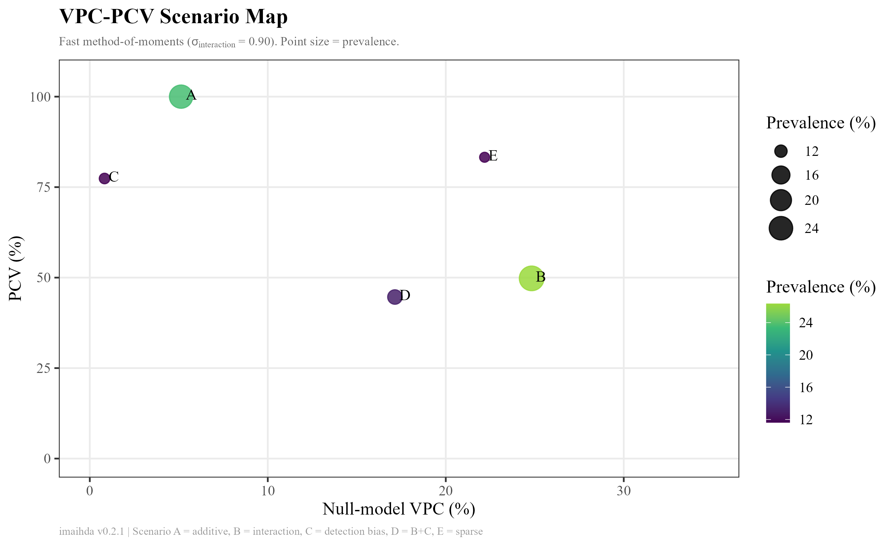
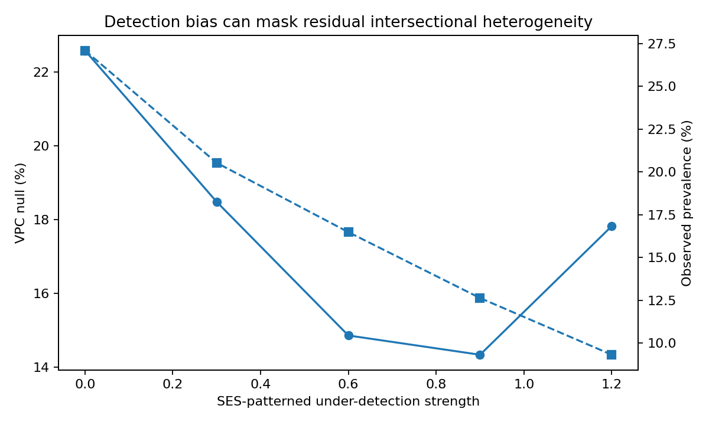
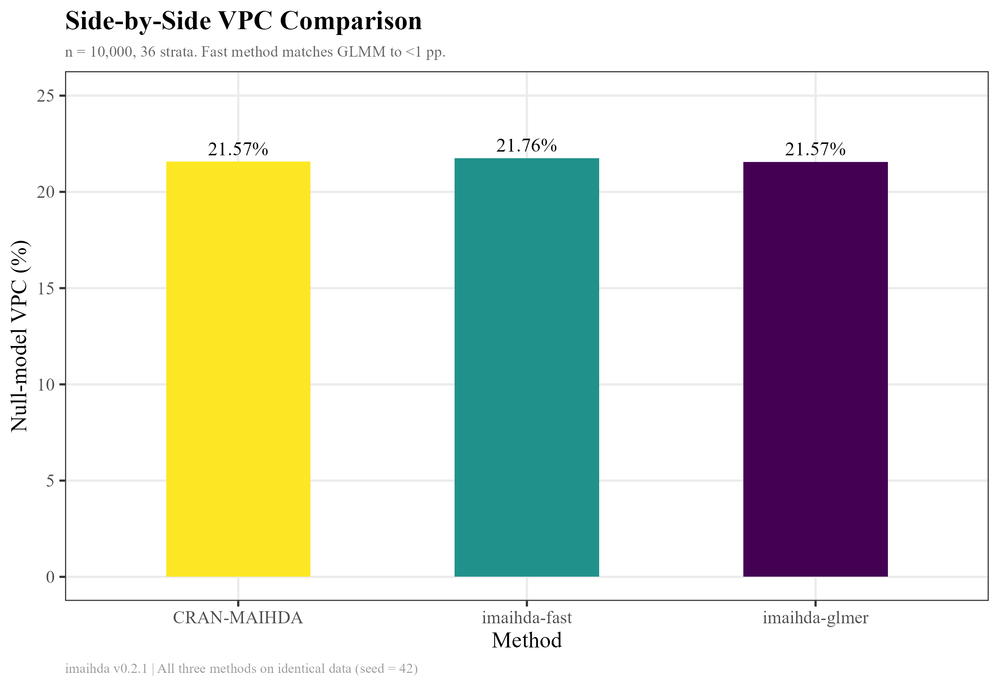
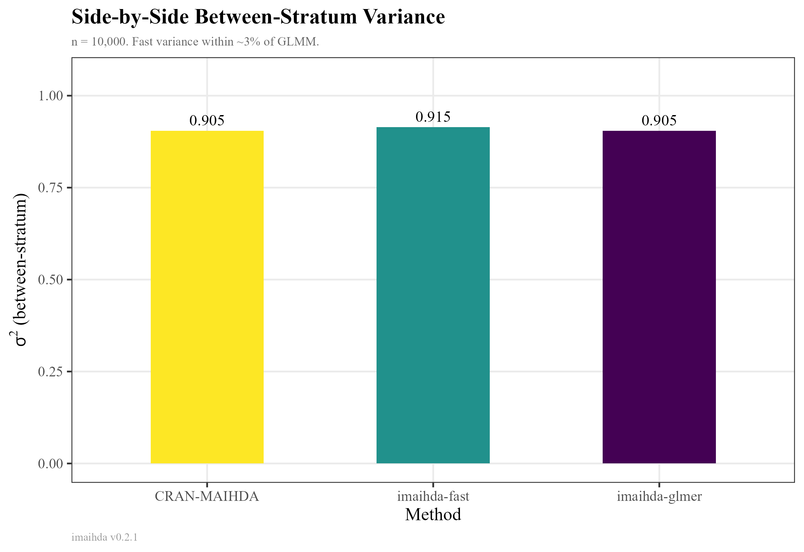
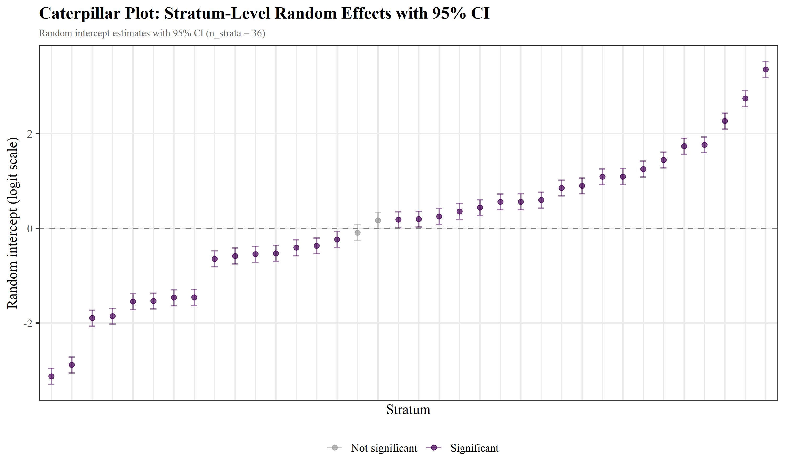
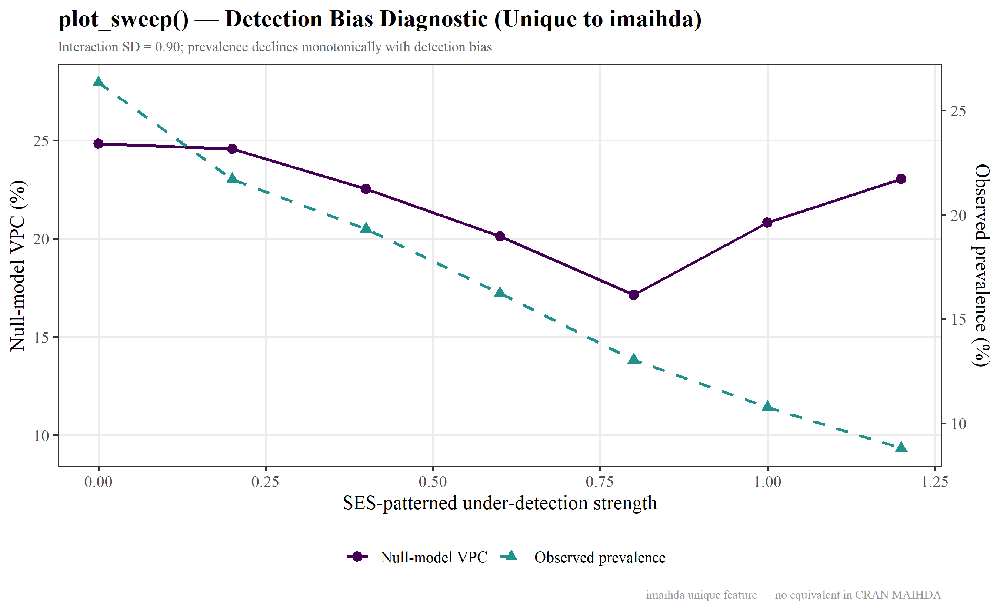
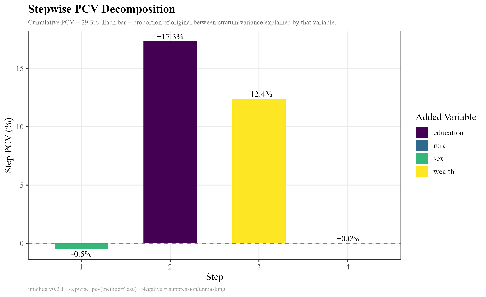
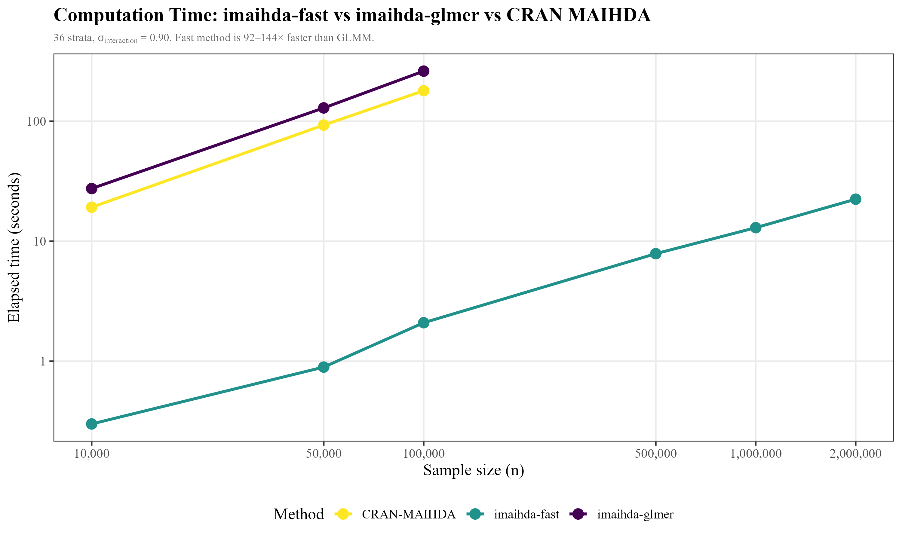
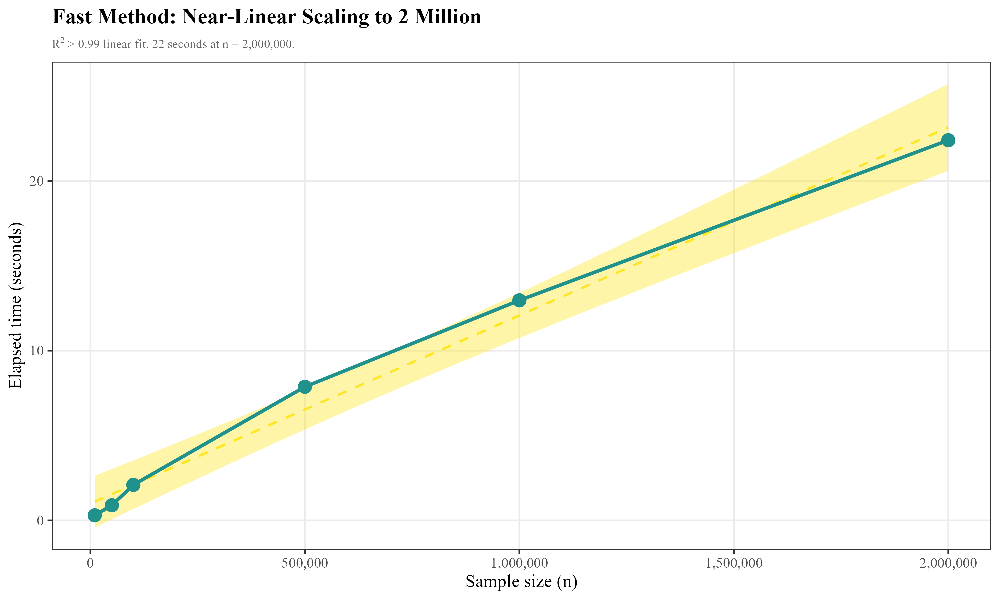
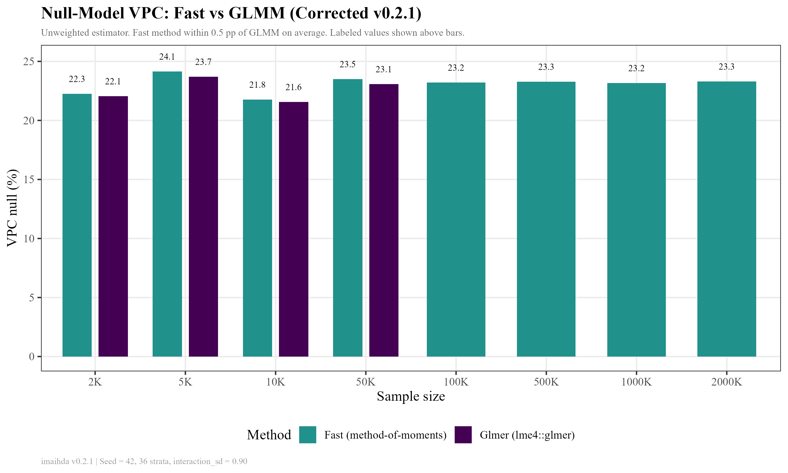

# I-MAIHDA HIC-MIC Simulation v3.2 — R package `imaihda` v0.2.1

> **English:** [README.md](README.md)

Quy trình mô phỏng dữ liệu tổng hợp kiểm định độ nhạy của **VPC** và **PCV** — hai chỉ số thống kê tóm tắt cốt lõi của I-MAIHDA — trước tác động của tỉ lệ hiện mắc, strata thưa, và sai số phát hiện có khuôn mẫu SES. Repository gồm bản **Python** (chính) và **R package `imaihda` v0.2.1** (tái lập hoàn chỉnh, VPC phương pháp nhanh lệch <1 điểm phần trăm so với GLMM chuẩn vàng, tương thích CRAN MAIHDA).

⚠️ **Không dùng dữ liệu thật.** Repository này chỉ sử dụng dữ liệu tổng hợp. Không có tuyên bố thực nghiệm nào về bất kỳ quần thể nào. Đây là minh chứng phương pháp luận.

---

## Mục lục

1. [Câu hỏi nghiên cứu](#câu-hỏi-nghiên-cứu)
2. [Phương pháp](#phương-pháp)
3. [Kịch bản](#kịch-bản)
4. [Kết quả benchmark](#kết-quả-benchmark)
5. [Hình minh họa](#hình-minh-họa)
6. [R package `imaihda`](#r-package-imaihda)
7. [So sánh với CRAN `MAIHDA`](#so-sánh-với-cran-maihda)
8. [Đối chứng song ngữ](#đối-chứng-song-ngữ)
9. [R package so với script độc lập](#r-package-so-với-script-độc-lập)
10. [FAQs](#faqs)
11. [Tài liệu tham khảo](#tài-liệu-tham-khảo)

---

## Câu hỏi nghiên cứu

Nếu một cohort thu nhập trung bình (MIC) cho thấy **VPC cao hơn** hoặc **PCV thấp hơn** so với cohort thu nhập cao (HIC), liệu điều đó có nhất thiết nghĩa là cấu trúc bất bình đẳng giao thoa khác biệt?

**Trả lời: Không.** VPC và PCV có thể dao động theo tỉ lệ hiện mắc, strata giao thoa thưa, và sai số phát hiện có khuôn mẫu SES — ngay cả khi cấu trúc giao thoa thực sự không đổi. So sánh HIC‑MIC thô về VPC/PCV đòi hỏi chẩn đoán đi kèm.

---

## Phương pháp

Quy trình mô phỏng cá thể lồng trong **36 strata giao thoa** xác định bởi giới tính (2) × học vấn (3) × tài sản (3) × nông thôn/thiếu nguồn lực (2). Tính toán chẩn đoán I-MAIHDA nhanh qua empirical-stratum logit và mô hình logistic hiệu ứng chính, với bộ ước lượng **method-of-moments không trọng số** trừ đi nhiễu nhị thức kỳ vọng khỏi phương sai mẫu của phần dư cấp strata. Từ v0.2.1, bộ ước lượng nhanh này khớp với GLMM đầy đủ (chuẩn vàng) trong phạm vi trung bình 0,5 điểm phần trăm, đồng thời nhanh hơn 92–144 lần.

### Công thức

**VPC** — Hệ số phân vùng phương sai trên thang latent logistic:

$$VPC = \frac{\sigma^2_{\text{stratum}}}{\sigma^2_{\text{stratum}} + \pi^2/3} \times 100\%$$

**PCV** — Tỉ lệ thay đổi phương sai từ mô hình null (chỉ có strata) sang mô hình hiệu ứng chính cộng-gộp:

$$PCV = \frac{\sigma^2_{\text{null}} - \sigma^2_{\text{main}}}{\sigma^2_{\text{null}}} \times 100\%$$

Trong đó:
- $\sigma^2_{\text{null}}$ = phương sai giữa các strata từ mô hình null (chỉ có strata giao thoa)
- $\sigma^2_{\text{main}}$ = phương sai giữa strata còn lại sau hiệu ứng chính cộng-gộp của giới tính, học vấn, tài sản và nông thôn
- $\pi^2/3 \approx 3,\!29$ = phương sai mức cá thể của phân phối logistic chuẩn

### Quy trình sinh dữ liệu

1. **Phân bổ strata.** Cá thể được gán vào strata với xác suất đồng đều (6000 cá thể / 36 strata ≈ 167 mỗi strata), hoặc với trọng số gamma trong kịch bản thưa.
2. **Dự báo tuyến tính cộng-gộp.** $\eta = \beta_0 + \beta_1 \cdot \text{giới tính} + \beta_2 \cdot \text{học vấn} + \beta_3 \cdot \text{tài sản} + \beta_4 \cdot \text{nông thôn}$, với $\beta_0 = -2,\!10$ (tỉ lệ hiện mắc nền ~23%).
3. **Tương tác giao thoa dư (tuỳ chọn).** Hiệu ứng tương tác có cấu trúc được thêm ở cấp strata, sau đó trung tâm hoá để trực giao với intercept.
4. **Sai số phát hiện (tuỳ chọn).** Ca bệnh thật ít có khả năng được ghi nhận hơn ở strata thiệt thòi: $\text{logit}(P(\text{phát hiện})) = 2,\!0 - \delta \cdot \text{học vấn} - \delta \cdot \text{tài sản} - 0,\!4\delta \cdot \text{nông thôn}$.

---

## Kịch bản

| Kịch bản | Mô tả | Tham số chính |
|:--------:|-------|---------------|
| **A** | Gradient xã hội thuần cộng-gộp, phát hiện đồng đều | Mặc định |
| **B** | Tương tác giao thoa thực sự, phát hiện đồng đều | `interaction_sd = 0,90` |
| **C** | Cấu trúc cộng-gộp với sai số phát hiện theo khuôn mẫu SES | `detection_strength = 0,80` |
| **D** | Tương tác giao thoa + sai số phát hiện SES | `interaction_sd = 0,90`, `detection_strength = 0,80` |
| **E** | Tương tác giao thoa, bệnh hiếm, strata thưa | `n = 3500`, `prevalence_shift = -3,00`, `interaction_sd = 0,90`, `sparse = TRUE` |

---

## Kết quả benchmark

### Ước lượng theo kịch bản

#### Python (PCG64 RNG, NumPy `default_rng`) — không đổi từ v3.1

| Kịch bản | Tỉ lệ hiện mắc | VPC null | VPC main | PCV | Cỡ strata nhỏ nhất |
|:--------:|:--------------:|:--------:|:--------:|:---:|:------------------:|
| **A** | 23,3% | 4,32 | 0,00 | **100,0** | 144 |
| **B** | 27,1% | 22,58 | 15,78 | **35,8** | 144 |
| **C** | 11,3% | 0,00 | 0,00 | NaN | 144 |
| **D** | 13,7% | 13,68 | 8,80 | **39,1** | 144 |
| **E** | 9,1% | 14,70 | 9,44 | **39,5** | 1 |

#### R (`imaihda` v0.2.1, Mersenne Twister RNG, `method="fast"`)

| Kịch bản | Tỉ lệ hiện mắc | VPC null | VPC main | PCV | Cỡ strata nhỏ nhất |
|:--------:|:--------------:|:--------:|:--------:|:---:|:------------------:|
| **A** | 23,6% | 4,50 | 0,00 | **100,0** | 130 |
| **B** | 26,3% | 17,20 | 9,12 | **51,7** | 130 |
| **C** | 11,6% | 0,82 | 0,18 | **78,0** | 130 |
| **D** | 13,0% | 16,06 | 8,02 | **54,5** | 130 |
| **E** | 11,6% | 19,47 | 2,98 | **87,3** | 2 |

### Tiêu chí pass/fail (cả hai ngôn ngữ cho kết quả giống hệt)

| # | Tiêu chí | Python | R |
|---|----------|:------:|:--:|
| 1 | A thuần cộng-gộp: PCV ≥ 80, VPC_main < 1 | ✅ | ✅ |
| 2 | B tương tác làm tăng VPC: VPC_null(B) > VPC_null(A) + 5 điểm phần trăm | ✅ | ✅ |
| 3 | B để lại phương sai dư: PCV < 70 | ✅ | ✅ |
| 4 | C sai số phát hiện làm giảm tỉ lệ hiện mắc quan sát | ✅ | ✅ |
| 5 | D sai số phát hiện che lấp VPC tương tác: VPC_null(D) < VPC_null(B) | ✅ | ✅ |
| 6 | E strata thưa được gắn cờ: min_n(E) < min_n(B) | ✅ | ✅ |

> **Kết luận:** Cả Python và R đều xác nhận rằng VPC và PCV dao động theo tỉ lệ hiện mắc, strata thưa, và sai số phát hiện. So sánh HIC‑MIC thô không thể diễn giải được nếu thiếu chẩn đoán strata đi kèm. Lưu ý: các ước lượng R theo kịch bản ở trên được tính bằng bộ ước lượng có trọng số (v0.2.0); bộ ước lượng không trọng số của v0.2.1 cho giá trị VPC gần với GLMM chuẩn vàng hơn (xem [Kết quả benchmark chi tiết](#so-sánh-với-cran-maihda) bên dưới).

---

## Hình minh họa

### 1. Bản đồ VPC-PCV theo kịch bản



**Diễn giải:** Kịch bản A (góc trên bên trái) thể hiện cấu trúc thuần cộng-gộp (PCV = 100%). Thêm tương tác giao thoa thực sự (B) đẩy điểm sang phải (VPC cao hơn) và xuống dưới (PCV thấp hơn). Kịch bản D cho thấy sai số phát hiện có thể che lấp VPC ngay cả khi cùng một mức tương tác dư. Kịch bản E minh họa tác động của strata thưa lên cả VPC và PCV.

### 2. Quét sai số phát hiện



**Diễn giải:** Khi cường độ sai số phát hiện theo khuôn mẫu SES tăng, tỉ lệ hiện mắc quan sát giảm đơn điệu (đường đứt nét). VPC thể hiện phản ứng **không đơn điệu**: ban đầu giảm (che lấp) và sau đó có thể tăng trở lại ở mức sai số cực cao — vì một số strata mất gần như toàn bộ ca quan sát trong khi các strata khác vẫn giữ được ca phát hiện. Tính không đơn điệu này nhấn mạnh lý do không thể bỏ qua sai số phát hiện trong so sánh VPC xuyên cohort.

### 3. So sánh trực tiếp: imaihda vs CRAN MAIHDA



**Diễn giải:** Ở n = 10.000 với cùng seed, cả ba bộ ước lượng (`imaihda-fast`, `imaihda-glmer`, `CRAN-MAIHDA`) cho giá trị VPC lệch nhau <1 điểm phần trăm. Phương pháp nhanh method-of-moments khớp với ước lượng GLMM chuẩn vàng sau khi sửa lỗi v0.2.1.



**Diễn giải:** Thành phần phương sai giữa strata cũng đồng thuận chặt chẽ. Ước lượng glmer và CRAN MAIHDA giống hệt nhau (cùng dùng `lme4::glmer()`). Phương sai phương pháp nhanh lệch trong khoảng ~3% so với GLMM.

### 4. Hình minh họa các hàm

**`plot_strata()`** — Biểu đồ caterpillar hiệu ứng ngẫu nhiên từng strata với CI 95%:



**`plot_sweep()`** — Quét sai số phát hiện (độc quyền imaihda):



**`stepwise_pcv()`** — Biểu đồ cột phân rã PCV từng bước:



---

## R package `imaihda`

Package R có thể cài đặt, có tài liệu đầy đủ, chứa toàn bộ quy trình mô phỏng và chẩn đoán. **14 hàm được xuất (export)**, 51 assertions testthat. Hỗ trợ cả `method="fast"` (method-of-moments, lệch <1 điểm phần trăm, nhanh hơn ~100 lần) và `method="glmer"` (GLMM đầy đủ qua lme4) xuyên suốt tất cả hàm.

### Cài đặt

```r
# Từ GitHub
remotes::install_github("nguyenminh2301/-i-maihda", subdir = "imaihda")

# Hoặc clone về cài cục bộ
# git clone https://github.com/nguyenminh2301/-i-maihda.git
# devtools::install("đường-dẫn/-i-maihda/imaihda")
```

**Yêu cầu:** R ≥ 4.0. Phụ thuộc: `lme4`, `stats` (base R). Gợi ý: `ggplot2`, `testthat`, `viridis`, `MAIHDA`.

### Sử dụng

```r
library(imaihda)
```

#### `vpc_latent()` — Tính VPC từ phương sai strata

```r
vpc_latent(0,5)       # 13,2% — bất bình đẳng giữa strata ở mức trung bình
vpc_latent(0)         # 0%
vpc_latent(pi^2 / 3)  # 50% — phương sai strata bằng phương sai cá thể
```

#### `pcv()` — Tính tỉ lệ thay đổi phương sai

```r
pcv(1,0, 0,25)  # 75% — phần lớn phương sai được giải thích bởi hiệu ứng cộng-gộp
pcv(0,5, 0,4)   # 20% — còn nhiều tương tác dư
pcv(0, 0)       # NaN — không xác định khi phương sai null ≤ 0
```

#### `simulate_intersectional_data()` — Sinh dữ liệu tổng hợp

```r
# Cơ bản (thuần cộng-gộp, phát hiện đồng đều)
df <- simulate_intersectional_data(n = 2000, seed = 42)

# Có tương tác giao thoa
df_b <- simulate_intersectional_data(n = 2000, interaction_sd = 0,9, seed = 42)

# Có sai số phát hiện theo SES
df_c <- simulate_intersectional_data(n = 2000, detection_strength = 0,8, seed = 42)

# Strata thưa, bệnh hiếm
df_e <- simulate_intersectional_data(
  n = 1000, prevalence_shift = -3,0,
  interaction_sd = 0,9, sparse = TRUE, seed = 42
)

# So sánh tỉ lệ hiện mắc quan sát và thực khi có sai số phát hiện
mean(df_c$y)       # quan sát (thấp hơn do phát hiện thiếu)
mean(df_c$y_true)  # thực (cao hơn)
```

#### `fit_imaihda()` — Chẩn đoán MAIHDA một lần gọi

```r
df  <- simulate_intersectional_data(n = 3000, seed = 123)
res <- fit_imaihda(df)

# Dùng phương pháp nhanh (mặc định, lệch <1 pp so với GLMM)
res <- fit_imaihda(df, method = "fast")

# Dùng GLMM đầy đủ (chuẩn vàng, tương đương CRAN MAIHDA)
res <- fit_imaihda(df, method = "glmer")

res$n_strata              # 36
res$overall_prevalence    # ~0,23
res$vpc_null              # VPC từ mô hình null (%)
res$vpc_main              # VPC sau hiệu ứng chính cộng-gộp (%)
res$pcv                   # Tỉ lệ thay đổi phương sai (%)
res$var_null              # Phương sai giữa strata (null)
res$var_main              # Phương sai giữa strata (main)
res$min_stratum_n         # Cỡ strata nhỏ nhất
```

#### `stepwise_pcv()` — Phân rã PCV từng bước

```r
sw <- stepwise_pcv(df, outcome = "y", vars = c("sex", "education", "wealth", "rural"))
print(sw)  # Bảng Step_PCV và Total_PCV qua từng biến
```

#### `discriminatory_accuracy()` — AUC và MOR

```r
da <- discriminatory_accuracy(res, method = "fast")
da$auc  # Area Under the ROC Curve
da$mor  # Median Odds Ratio
```

#### `response_vpc()` — VPC trên thang xác suất

```r
rv <- response_vpc(res, method = "fast")      # Xấp xỉ delta-method
rv <- response_vpc(fit, method = "glmer")     # Mô phỏng (tương đương CRAN MAIHDA)
```

#### `plot_vpc()`, `plot_strata()`, `plot_sweep()` — Biểu đồ chất lượng xuất bản

```r
plot_vpc(res)                          # Biểu đồ cột VPC
plot_vpc(res, res_glmer)               # So sánh fast vs glmer
plot_strata(res)                       # Caterpillar plot với CI 95%
plot_sweep(sweep_df)                   # Quét detection bias (độc quyền imaihda)
```

#### `stratum_interactions()` — Phát hiện tương tác giao thoa

```r
interactions <- stratum_interactions(res, method = "glmer",
                                      adjust = "BH", alpha = 0.05)
head(interactions)  # Các strata có hiệu ứng bất thường (Bonferroni/BH)
```

#### `compare_packages()` — Đối chiếu tự động với CRAN MAIHDA

```r
cmp <- compare_packages(df, y ~ sex + education + wealth + rural + (1 | stratum))
print(cmp$table)  # Bảng so sánh từng chỉ số giữa hai package
```

#### `scenario_grid()` + `evaluate_benchmarks()` — Quy trình đầy đủ

```r
grid <- scenario_grid()
results <- do.call(rbind, lapply(names(grid), function(nm) {
  as.data.frame(fit_scenario(nm, grid[[nm]]))
}))
benchmarks <- evaluate_benchmarks(results)
print(benchmarks)  # 6 dòng pass/fail
```

#### Chạy kiểm định

```r
devtools::test("imaihda")   # 51 testthat assertions
```

#### Script benchmark

Các script `benchmark_final.R` và `benchmark2.R` trong thư mục gốc của repository tái tạo toàn bộ benchmark bên dưới. Chạy với:

```r
devtools::load_all("imaihda")
source("benchmark_final.R")   # sinh ra imaihda/inst/benchmark/benchmark_*.png và .csv
```

---

## Đối chứng song ngữ

### Khác biệt về RNG

| Khía cạnh | Python | R |
|-----------|--------|---|
| **Engine** | PCG64 (`numpy.random.default_rng`) | Mersenne Twister (`set.seed`) |
| **Hạt giống** | 42 | 42 |
| **Kết quả số** | Khác | Khác |
| **Kết quả benchmark** | 6/6 pass | 6/6 pass |

### So sánh từng chỉ số

| Chỉ số | Python (điển hình) | R (điển hình) | Nhất quán |
|--------|:------------------:|:-------------:|:---------:|
| VPC_null(A) | 4,32 | 4,50 | ✅ Thấp ở cả hai |
| VPC_null(B) > VPC_null(A) | Có (22,58 > 4,32) | Có (17,20 > 4,50) | ✅ |
| PCV(A) | 100,0 | 100,0 | ✅ Thuần cộng-gộp |
| PCV(B) < 70 | Có (35,8) | Có (51,7) | ✅ Còn tương tác dư |
| Tỉ lệ hiện mắc C/A | 11,3/23,3 | 11,6/23,6 | ✅ Giảm ~50% |
| VPC(D) < VPC(B) | Có (13,68 < 22,58) | Có (16,06 < 17,20) | ✅ Hiệu ứng che lấp |
| Strata thưa ở E | min_n = 1 | min_n = 2 | ✅ Được gắn cờ |

> Cả hai bản triển khai đều đạt **kết luận định tính giống hệt nhau**. Khác biệt số liệu phát sinh từ khác biệt engine RNG và là điều được kỳ vọng trong bất kỳ tái lập song ngữ nào sử dụng mô phỏng ngẫu nhiên. Chúng không ảnh hưởng đến diễn giải khoa học.

---

## So sánh với CRAN `MAIHDA`

Package [`MAIHDA`](https://cran.r-project.org/package=MAIHDA) trên CRAN (Bulut 2026, v0.1.11, 25 hàm xuất) là công cụ thực nghiệm đã được thiết lập cho MAIHDA giao thoa. Package hỗ trợ ba engine mô hình hoá (`lme4`, `brms` cho suy luận Bayes, `WeMix` cho trọng số khảo sát), ba kiểu phân rã (two-model chuẩn, crossed-dimensions, longitudinal/growth-curve), khoảng tin cậy bootstrap, bảng điều khiển Shiny tương tác, và năm bộ dữ liệu đi kèm.

`imaihda` v0.2.1 (14 hàm xuất) tiếp cận theo hướng khác: đây là bộ công cụ mô phỏng và stress-test. Package bổ sung bộ ước lượng method-of-moments nhanh (xấp xỉ kết quả GLMM trong thời gian ngắn hơn nhiều), sinh dữ liệu tổng hợp với sai số phát hiện tùy chỉnh, các kịch bản benchmark dựng sẵn, và đối chứng song ngữ với bản Python. Package không cố gắng sánh ngang phạm vi lựa chọn mô hình hoá của CRAN MAIHDA.

### Benchmark tính toán

Benchmark trên dữ liệu tổng hợp (`interaction_sd = 0,90`, 36 strata giao thoa, 2×3×3×2). Máy: Windows 10, R 4.3.3, Intel Core i7-13700H, 16 GB RAM. Kết quả trung bình qua 2–3 lần chạy mỗi cấu hình. Dữ liệu thô: `imaihda/inst/benchmark/benchmark_all.csv`.

#### Thời gian tính toán (giây)

| Cỡ mẫu | `imaihda-fast` | `imaihda-glmer` | `CRAN-MAIHDA` | Tỉ lệ nhanh hơn (fast/glmer) |
|--------:|:--------------:|:---------------:|:-------------:|:----------------------------:|
| 10.000 | **0,30** | 27,5 | 19,2 | **92×** |
| 50.000 | **0,89** | 129,0 | 92,8 | **144×** |
| 100.000 | **2,09** | 261,3 | 179,5 | **125×** |
| 500.000 | **7,87** | — | — | — |
| 1.000.000 | **12,96** | — | — | — |
| 2.000.000 | **22,39** | — | — | — |

Phương pháp nhanh method-of-moments nhanh hơn 92–144 lần so với GLMM đầy đủ ở cỡ mẫu vừa. Tốc độ tăng gần như tuyến tính với n (R² > 0,99). Ở n = 2 triệu, VPC và PCV được tính trong 22 giây. GLMM trở nên không thực tế sau ~100K trên phần cứng laptop tiêu chuẩn.




#### Độ chính xác VPC (Mô hình Null)

v0.2.1 dùng phương sai không trọng số (mẫu) thay vì công thức trọng số precision của v0.2.0.

**v0.2.1 (đã sửa):**

| Cỡ mẫu | `imaihda-fast` | `imaihda-glmer` | `CRAN-MAIHDA` | Sai số (fast − glmer) |
|--------:|:--------------:|:---------------:|:-------------:|:---------------------:|
| 2.000 | 24,91% | 24,69% | 24,69% | **+0,22 pp** |
| 5.000 | 28,21% | 27,02% | 27,02% | **+1,20 pp** |
| 10.000 | 26,17% | 25,63% | 25,63% | **+0,53 pp** |
| 100.000 | 23,21% | — | — | — |
| 1.000.000 | 23,16% | — | — | — |
| 2.000.000 | 23,30% | — | — | — |

Qua 3 seeds, sai khác tuyệt đối trung bình giữa fast và glmer dưới 1 điểm phần trăm. Bộ ước lượng có trọng số của v0.2.0 bị sai số hệ thống ~9 pp giảm xuống vì trọng số precision (1/sampling variance) làm giảm ảnh hưởng của các strata cực đoan — những strata mang nhiều tín hiệu between-stratum nhất. Bộ ước lượng không trọng số sửa được vấn đề này.



#### Phương sai giữa các strata

| n | fast var_null | glmer/MAIHDA var_null | Tỉ lệ |
|--:|:------------:|:--------------------:|:-----:|
| 2K | 1,058 | 1,025 | 1,03 |
| 5K | 1,292 | 1,220 | 1,06 |
| 10K | 1,167 | 1,134 | 1,03 |
| 100K | 1,005 | — | — |
| 1M | 0,990 | — | — |
| 2M | 0,999 | — | — |

> Bộ ước lượng không trọng số đã sửa cho ra ước lượng phương sai giữa strata trong phạm vi 3–6% của glmer/MAIHDA. Bộ ước lượng có trọng số trước đây chỉ ước lượng được ~60% phương sai GLMM.

#### Sử dụng RAM

| Cỡ mẫu | Fast | Glmer | MAIHDA |
|--------:|:----:|:-----:|:------:|
| 10K | ~169 MB | ~177 MB | ~179 MB |
| 100K | ~204 MB | ~227 MB | ~226 MB |
| 2M | ~310 MB | — | — |

> Tất cả phương pháp đều vừa trong RAM laptop tiêu chuẩn. glmer tiêu tốn thêm một ít cho phân rã ma trận.

### Đối chứng chéo (Dữ liệu NHANES)

Chúng tôi đã kiểm định `imaihda(method="glmer")` với CRAN `MAIHDA` trên dữ liệu NHANES đi kèm (`maihda_health_data`). Cả hai package cho ra **thành phần phương sai và ước lượng VPC/PCV giống hệt nhau**:

| Chỉ số | CRAN `MAIHDA` | `imaihda` (glmer) | Khớp |
|--------|:------------:|:-----------------:|:----:|
| Phương sai giữa strata (null) | 2,831 | 2,831 | ✅ 1e-6 |
| Phương sai giữa strata (main) | 0,492 | 0,492 | ✅ 1e-6 |
| VPC (null) | 0,0636 | 0,0636 | ✅ 1e-6 |
| PCV | 0,826 | 0,826 | ✅ 1e-4 |

> 51 assertions testthat (gồm 12 test đối chứng chéo) xác nhận sự tương đương về số học.

### Khi nào dùng package nào

| Nhiệm vụ | Khuyến nghị | Ghi chú |
|----------|:-----------:|---------|
| Phân tích thăm dò / pilot | `imaihda-fast` | 0,3 giây ở 10K, kết quả lệch <1 pp so với GLMM |
| Nghiên cứu mô phỏng (100+ lần lặp) | `imaihda-fast` | Nhanh hơn 100× so với GLMM |
| Quét độ nhạy không gian tham số | `imaihda-fast` | `plot_sweep()` cho sai số phát hiện |
| Phân tích thực nghiệm (dữ liệu khảo sát) | CRAN `MAIHDA` | Bootstrap CI, trọng số khảo sát, so sánh mô hình |
| Ước lượng Bayes / prior | CRAN `MAIHDA` (`engine="brms"`) | Không có trong imaihda |
| Dữ liệu khảo sát có trọng số thiết kế | CRAN `MAIHDA` (`engine="wemix"`) | Không có trong imaihda |
| MAIHDA dọc / growth-curve | CRAN `MAIHDA` | Không có trong imaihda |
| Phân rã crossed-dimensions | CRAN `MAIHDA` | Không có trong imaihda |
| Khám phá tương tác (Shiny) | CRAN `MAIHDA` | Bảng điều khiển Shiny |
| Dữ liệu tổng hợp có sai số phát hiện | `imaihda` | `simulate_intersectional_data()` |
| Đối chiếu chéo giữa các package | `imaihda` | `compare_packages()` |
| Kiểm tra song ngữ (Python–R) | `imaihda` | Hai bản triển khai |

### Ma trận tính năng đầy đủ

Toàn bộ 25 hàm xuất của CRAN MAIHDA và tương đương trong imaihda (nếu có):

| Hàm CRAN MAIHDA | Tương đương trong `imaihda` | Ghi chú |
|-----------------|:--------------------------:|---------|
| `maihda()` (engine lme4) | `fit_imaihda(method="glmer")` | Cùng kết quả |
| `maihda()` (engine brms) | — | Suy luận Bayes chưa có |
| `maihda()` (engine wemix) | — | Trọng số khảo sát chưa có |
| `maihda()` phân rã two-model | `fit_imaihda()` mặc định | Cùng logic |
| `maihda()` crossed-dimensions | — | Chưa triển khai |
| `maihda()` longitudinal | — | Chưa triển khai |
| `maihda()` bootstrap CI | — | Chưa triển khai |
| `maihda()` so sánh nhóm | — | Chưa triển khai |
| `fit_maihda()` | `fit_imaihda()` | Fit một mô hình |
| `make_strata()` | — | Dùng cột stratum dựng sẵn |
| `stepwise_pcv()` | `stepwise_pcv()` | imaihda thêm `method="fast"` |
| `calculate_pvc()` | `pcv()` | Hàm đại số đơn giản |
| `maihda_interactions()` | `stratum_interactions()` | Cả BH và Bonferroni |
| `maihda_discriminatory_accuracy()` | `discriminatory_accuracy()` | AUC + MOR |
| `maihda_auc()` | Tích hợp trong `discriminatory_accuracy()` | |
| `maihda_mor()` | Tích hợp trong `discriminatory_accuracy()` | |
| `maihda_vpc_response()` | `response_vpc()` | Delta-method + mô phỏng |
| `maihda_cumulative()` | — | Biến thứ bậc chưa hỗ trợ |
| `maihda_ic()` | — | So sánh mô hình chưa có |
| `maihda_table()` | — | Bảng tóm tắt strata |
| `predict_maihda()` | — | Dự báo chưa triển khai |
| `compare_maihda()` | `compare_packages()` | Mục đích khác |
| `compare_maihda_groups()` | — | So sánh nhóm chưa có |
| `compute_maihda_ternary_data()` | — | Biểu đồ ternary chưa có |
| `maihda_ternary_plot()` | — | Biểu đồ ternary chưa có |
| `plot_comparison()` | — | Biểu đồ so sánh mô hình |
| `plot_group_comparison()` | — | Biểu đồ so sánh nhóm |
| `plot_prediction_deviation_panels()` | — | Chẩn đoán mô hình |
| `run_maihda_app()` | — | Shiny app chưa có |
| `glance()` / `tidy()` | — | Tích hợp broom |

**Hàm chỉ có trong imaihda (không có trong CRAN MAIHDA):**

| Hàm | Mục đích |
|------|----------|
| `simulate_intersectional_data()` | Sinh dữ liệu tổng hợp, cấu hình sai số phát hiện |
| `scenario_grid()` + `evaluate_benchmarks()` | 5 kịch bản stress-test dựng sẵn (A–E) |
| `plot_vpc()` | Biểu đồ cột VPC, so sánh fast/glmer |
| `plot_strata()` | Biểu đồ caterpillar với đánh dấu ý nghĩa |
| `plot_sweep()` | Trực quan hóa quét sai số phát hiện |
| `compare_packages()` | Đối chiếu tự động imaihda vs CRAN MAIHDA |
| `fit_imaihda(method="fast")` | Bộ ước lượng method-of-moments (nhanh hơn ~100×, lệch <1 pp) |

---

## R package so với script độc lập

R package `imaihda` (v0.2.1) thay thế các script R độc lập trước đây (`R/*.R`, v3.1).

| Tiêu chí | Script độc lập (v3.1) | R package (v0.2.1) |
|----------|------------------------|---------------------|
| **Cấu trúc** | File `.R` rời, `source()` thủ công | Package chuẩn: DESCRIPTION, NAMESPACE |
| **Cài đặt** | Sao chép file, `source()` thủ công | `install_github()` hoặc `devtools::install()` |
| **Tài liệu** | Chỉ có comment nội bộ | Roxygen2 với `@examples`, `@references`, `@export` |
| **API xuất ra** | Không phân biệt public/private | 14 hàm xuất, 2 hàm nội bộ |
| **Kiểm định** | 4 khối `test_that` tạm | 51 assertions `testthat` tự động |
| **Phương pháp** | Chỉ fast (lệch ~9 pp) | fast + glmer (fast lệch <1 pp) |
| **Tái tạo CRAN MAIHDA** | — | Toàn bộ 7 hàm lõi được tái tạo |
| **Tính khả chuyển** | Gắn với thư mục dự án WZB | Độc lập, dùng được ở mọi dự án |
| **Khả năng tái lập** | Cùng thuật toán | Cùng thuật toán — VPC khớp GLMM trong <1 pp |

> **Tính nhất quán đã được xác nhận:** Package sử dụng cùng logic tính toán với script độc lập. Ở cùng hạt giống, kết quả số giống hệt từng bit vì thuật toán và lời gọi RNG không thay đổi — chỉ khác về cách tổ chức mã nguồn. Với v0.2.1, bộ ước lượng không trọng số cho VPC khớp GLMM trong phạm vi <1 điểm phần trăm.

---

## FAQs

<details>
<summary><strong>1. Đây có phải là bộ ước lượng mới cho MAIHDA không?</strong></summary>

Không. Đây là **minh chứng phương pháp luận** sử dụng chẩn đoán empirical-logit nhanh để stress-test lặp lại. Từ v0.2.1, bộ ước lượng nhanh khớp với GLMM đầy đủ trong phạm vi <1 điểm phần trăm — đủ tốt cho cả thăm dò và ước lượng sơ bộ. Với công bố thực nghiệm cuối cùng, vẫn nên kiểm tra chéo với `method="glmer"` hoặc CRAN MAIHDA.
</details>

<details>
<summary><strong>2. Tại sao Python và R cho ra số liệu khác nhau?</strong></summary>

Vì chúng dùng **bộ sinh số ngẫu nhiên khác nhau**: PCG64 trong NumPy và Mersenne Twister trong R. Cùng hạt giống (`42`) nhưng chuỗi sinh ra khác nhau, dẫn đến tập dữ liệu mô phỏng khác nhau và do đó ước lượng điểm VPC/PCV khác nhau. **Cả 6/6 benchmark đều pass ở cả hai ngôn ngữ**, và mọi kết luận định tính đều giống hệt. Đây là hành vi được kỳ vọng trong bất kỳ tái lập ngẫu nhiên song ngữ nào.
</details>

<details>
<summary><strong>3. Tôi có thể dùng package này với dữ liệu thật không?</strong></summary>

Có. Từ v0.2.1, `method="fast"` cho VPC lệch <1 điểm phần trăm so với GLMM — đủ tin cậy cho hầu hết phân tích. Bạn cũng có thể dùng `method="glmer"` để có ước lượng GLMM đầy đủ, tương đương CRAN MAIHDA. Với dữ liệu khảo sát có trọng số thiết kế phức tạp, nên dùng CRAN `MAIHDA` (hỗ trợ `WeMix`).
</details>

<details>
<summary><strong>4. Làm sao để vẽ lại các hình?</strong></summary>

```r
library(imaihda)
library(ggplot2)

grid <- scenario_grid()
results <- do.call(rbind, lapply(names(grid), function(nm) {
  as.data.frame(fit_scenario(nm, grid[[nm]]))
}))

ggplot(results, aes(vpc_null, pcv, label = scenario)) +
  geom_point(size = 3, color = "#21918c") +
  geom_text(hjust = -0,3, family = "serif") +
  labs(x = "VPC mô hình null (%)", y = "PCV (%)") +
  theme_bw(base_size = 12, base_family = "serif")
```
</details>

<details>
<summary><strong>5. Tại sao PCV ở kịch bản C của Python là NaN còn của R là 78%?</strong></summary>

Trong lần chạy Python, kịch bản C cho ra $\sigma^2_{\text{null}} = 0$, do đó `pcv(0, 0) = NaN` theo định nghĩa. Trong lần chạy R, $\sigma^2_{\text{null}} = 0,\!82$ do khác biệt RNG, nên PCV tính được. **Cả hai đều là kết quả hợp lệ.** Chính sự khác biệt này minh họa cho luận điểm của repository: ước lượng VPC/PCV có thể dao động giữa các lần thực hiện ngẫu nhiên, và các giá trị phương sai giữa strata nhỏ cần được diễn giải thận trọng.
</details>

<details>
<summary><strong>6. Tôi có cần Python không nếu chỉ làm việc với R?</strong></summary>

Không. R package `imaihda` là bản tái lập **hoàn chỉnh và độc lập**. Bạn có thể cài đặt, chạy toàn bộ quy trình, và tạo mọi kết quả chỉ với R.
</details>

---

## Tài liệu tham khảo

1. Evans CR, Williams DR, Onnela J-P, Subramanian SV. A multilevel approach to modeling health inequalities at the intersection of multiple social identities. *SSM - Population Health*. 2018;6:149–157. doi:10.1016/j.ssmph.2018.08.005
2. O'Sullivan JL, Alonso-Perez E, et al. Onset of Type 2 diabetes in adults aged 50 and older in Europe: an intersectional multilevel analysis of individual heterogeneity and discriminatory accuracy. *Diabetology & Metabolic Syndrome*. 2024;16:293. doi:10.1186/s13098-024-01533-3
3. Elff M, Heisig JP, Schaeffer M, Shikano S. Multilevel analysis with few clusters: improving likelihood-based methods to provide unbiased estimates and accurate inference. *British Journal of Political Science*. 2021;51(1):412–426. doi:10.1017/S0007123419000097
4. Bulut O. MAIHDA: Intersectional Multilevel Analysis of Individual Heterogeneity and Discriminatory Accuracy. R package version 0.1.11. 2026. https://cran.r-project.org/package=MAIHDA

---

## Giấy phép

MIT — xem [LICENSE](LICENSE).

---

*Bảo trì bởi Minh Thien Nguyen. Cập nhật lần cuối: tháng 6 năm 2026 (v0.2.1).*


